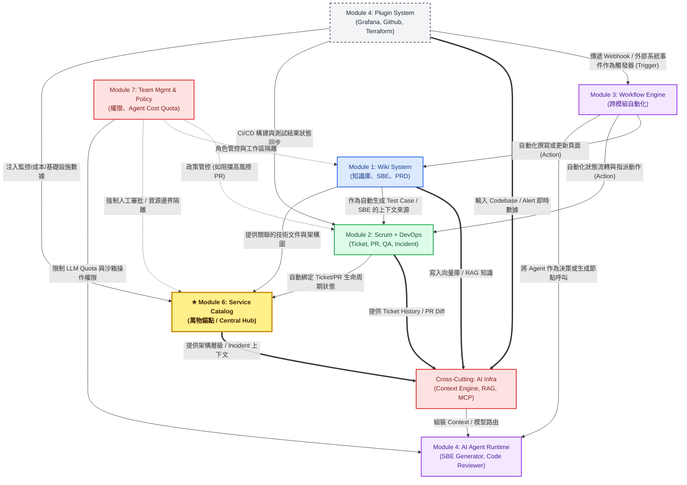
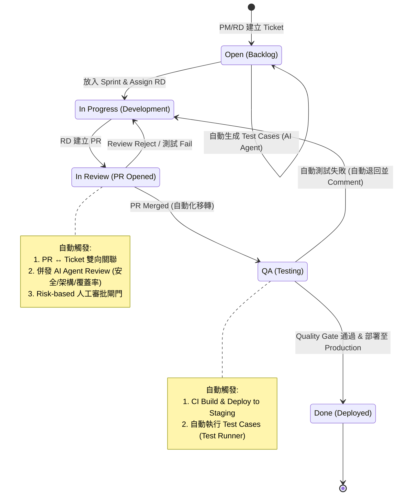
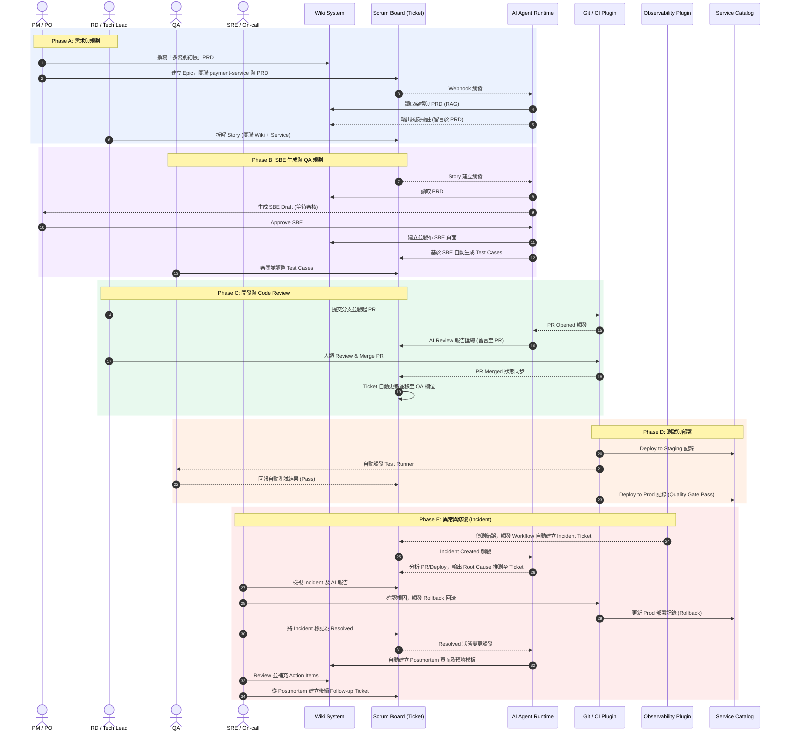

# Product Requirements Document (PRD)

## AI-Native Internal Developer Platform

| 欄位         | 內容                                                         |
| ------------ | ------------------------------------------------------------ |
| **產品名稱** | AI-Native Internal Developer Platform（暫定）                |
| **文件版本** | v0.3 — Full IDP for All Engineering Roles                    |
| **建立日期** | 2026-03-04                                                   |
| **文件狀態** | Draft                                                        |
| **參考文件** | 《AI 時代敏捷開發價值交付》、《2026 代理式工程深度研究報告》 |

---

## 1. 產品願景與戰略定位

### 1.1 願景聲明

在 2026 年的代理式工程（Agentic Engineering）時代，軟體開發已從「人類撰寫語法」轉向「意圖表達與代理編排」。然而現有工具鏈（Confluence + JIRA + n8n + Backstage + Grafana + PagerDuty + 各種 AI 工具）彼此割裂，每個角色被迫在十幾個工具間切換。PM 在 Confluence 寫需求，RD 在 JIRA 領 Ticket，DevOps 在 Backstage 看 Service，SRE 在 Grafana 盯監控，QA 在另一個系統管測試案例——**知識、流程與價值交付的上下文在工具切換中不斷流失**。

本產品旨在打造一個**統一的 Internal Developer Platform (IDP)**，讓 **RD、QA、DevOps、SRE、PM、UI/UX** 所有角色都能在同一個平台上協作並交付價值。平台以 **Service（服務）** 為核心實體，串連知識管理、Scrum 流程、DevOps 工程、可觀測性、事件管理、n8n 等級工作流引擎與自定義 AI Agent 編排能力。團隊能將自行開發的 AI Agent App 引入工作流中，持續實驗並優化**知識分享、流程控管與價值交付**的每一個環節。

### 1.2 平台分層架構理念

```
┌─────────────────────────────────────────────────────────────┐
│          Layer 3: Intelligence & Automation                  │
│  AI Agent Runtime · Workflow Engine · Predictive Analytics   │
├─────────────────────────────────────────────────────────────┤
│          Layer 2: Engineering Platform Core                  │
│  Service Catalog · Environments · Observability ·            │
│  Incident Mgmt · API Catalog · QA Management · FinOps       │
│  (Core entity + Plugin-powered data)                        │
├─────────────────────────────────────────────────────────────┤
│          Layer 1: Collaboration Foundation                   │
│  Wiki · Scrum/Backlog · PR/Code Review · RBAC · Notifications│
└─────────────────────────────────────────────────────────────┘
```

- **Layer 1**（Core Modules）：所有角色的協作基礎——Wiki、Scrum、PR/Code Review、RBAC
- **Layer 2**（Core Entity + Plugin Data）：Service Catalog 為 Core Module 定義實體與關係，Observability / Infrastructure / FinOps 等透過 Plugin 注入資料
- **Layer 3**（Core Modules）：Workflow Engine + AI Agent Runtime 是核心差異化，驅動跨層自動化

### 1.3 核心設計原則

| 原則                                         | 說明                                                                                                                                |
| -------------------------------------------- | ----------------------------------------------------------------------------------------------------------------------------------- |
| **Service-Centric Everything**               | Service 是平台的中心實體——Ticket、PR、Wiki、Incident、Environment、Dashboard 全部掛在 Service 上                                    |
| **Knowledge-Driven Delivery**                | 知識資產（Wiki）與交付單元（Ticket）、程式碼變更（PR）、服務（Service）深度互連，需求到部署全程可追溯                               |
| **AI-Augmented, Human-in-the-Loop**          | AI 負責數據準備、上下文彙整與自動化審查，人類負責最終判斷；關鍵決策節點強制人工審批                                                 |
| **Composable Agent Orchestration**           | Workflow 引擎具備 n8n 等級的組合能力，原生支援自定義 AI Agent App 作為流程節點                                                      |
| **Risk-Aware Dynamic Pipeline**              | 系統依據 Ticket/PR 風險分數，動態調整審查嚴格度與自動化程度                                                                         |
| **Evidence-Based Measurement**               | 內建 DORA（含 Rework Rate）、SPACE、EBM 等現代框架，摒棄速率幻覺                                                                    |
| **Core Defines Entities, Plugins Sync Data** | Core Module 定義實體與關係，Plugin 負責與外部工具同步資料。平台不重造 Grafana 或 Terraform，而是將其資料統一呈現於 Service 上下文中 |

### 1.4 目標使用者

| 角色                           | 使用場景                                                                                           | 核心接觸模組                                                                         |
| ------------------------------ | -------------------------------------------------------------------------------------------------- | ------------------------------------------------------------------------------------ |
| **Product Manager / Owner**    | 管理 Backlog、定義假設驗證實驗、追蹤價值交付指標、審閱 AI 生成的 SBE、查看需求追溯矩陣             | Wiki, Scrum, Metrics                                                                 |
| **Scrum Master / Agile Coach** | 引導 Sprint 儀式、監控團隊健康度、設計 Workflow 自動化、監督 AI 使用邊界                           | Scrum, Workflow, Metrics                                                             |
| **Software Engineer (RD)**     | 查閱 Wiki 需求、領取 Ticket、提交 PR、審閱 AI Code Review、編排 AI Agent 工作流、查看 Service 狀態 | Wiki, Scrum, PR/Review, Service Catalog, Workflow                                    |
| **QA Engineer**                | 管理 Test Cases、追蹤測試執行結果、審閱 AI 生成的 SBE/Test、設定 Quality Gates                     | Scrum (Test Case), Wiki (SBE), Workflow                                              |
| **DevOps Engineer**            | 查看 CI/CD Pipeline 狀態、管理 Environment、設定部署 Workflow、查看 Service 基礎設施               | Service Catalog, Workflow, Plugin (CI/CD, Infra)                                     |
| **SRE**                        | 監控 Service Health / SLO、管理 Incident 生命週期、撰寫 Postmortem、設定 On-call 排班              | Service Catalog, Scrum (Incident), Wiki (Postmortem/Runbook), Plugin (Observability) |
| **UI/UX Designer**             | 在 Ticket 上追蹤設計任務、嵌入 Figma 設計稿、參與 Design Review Workflow                           | Scrum, Wiki, Plugin (Figma)                                                          |
| **AI / Platform Engineer**     | 開發並註冊 AI Agent App、設計多代理編排流程、管理 Agent Runtime                                    | Plugin & Agent System, Workflow                                                      |
| **Engineering Manager**        | 綜覽跨團隊 DORA 指標、風險預警、PR Review 瓶頸、Service Health、成本分析                           | Metrics, Service Catalog, Scrum                                                      |
| **Organization Admin**         | 設定 RBAC 政策、管理 Workspace、Plugin 與 Agent 生態、治理 AI 使用邊界                             | Team Management                                                                      |

---

## 2. 系統架構概覽

### 2.1 Core Modules（7 個）

```
┌──────────────────────────────────────────────────────────────────────────────┐
│                     AI-Native Internal Developer Platform                     │
│                                                                              │
│  ┌──────────────┐  ┌──────────────────┐  ┌─────────────────────────────────┐ │
│  │  Wiki System  │  │ Scrum + DevOps   │  │   Workflow Engine (n8n-level)  │ │
│  │  (Module 1)   │  │ (Module 2)       │  │         (Module 3)             │ │
│  │               │  │ Backlog · PR ·   │  │  Trigger · Condition · Action  │ │
│  │  Knowledge    │  │ Review · CI/CD · │  │  Transform · AI Agent Node ·   │ │
│  │  SBE · ADR    │  │ Incident · QA    │  │  Human Approval · Sub-workflow │ │
│  └──────┬───────┘  └────────┬─────────┘  └──────────────┬──────────────────┘ │
│         │                   │                            │                    │
│         │     ┌─────────────▼─────────────┐              │                    │
│         │     │   ★ Service Catalog ★      │              │                    │
│         ├────►│      (Module 6 — NEW)      │◄─────────────┘                    │
│         │     │  THE central hub entity    │                                  │
│         │     │  Service · Environment ·   │                                  │
│         │     │  Owner · Health · Cost     │                                  │
│         │     └─────────────┬─────────────┘                                  │
│         │                   │                                                │
│  ┌──────▼───────────────┐   │   ┌────────────────────┐  ┌────────────────┐   │
│  │ Plugin & Agent System │   │   │ Team Management    │  │ Metrics &      │   │
│  │ (Module 4)            │◄──┘   │ RBAC & Policy      │  │ Analytics      │   │
│  │                       │       │ (Module 5)         │  │ Engine (Mod 7) │   │
│  │ ┌──────────────────┐  │       └────────────────────┘  └────────────────┘   │
│  │ │ Agent Runtime     │  │                                                   │
│  │ │ (Custom AI Apps)  │  │                                                   │
│  │ └──────────────────┘  │                                                   │
│  │                       │                                                   │
│  │ ┌──────────────────┐  │                                                   │
│  │ │ Plugin Ecosystem  │  │                                                   │
│  │ │ Observability ·   │  │                                                   │
│  │ │ Infrastructure ·  │  │                                                   │
│  │ │ FinOps · Design · │  │                                                   │
│  │ │ API Catalog ·     │  │                                                   │
│  │ │ Git · CI/CD ·     │  │                                                   │
│  │ │ Communication     │  │                                                   │
│  │ └──────────────────┘  │                                                   │
│  └───────────────────────┘                                                   │
│                                                                              │
│  ┌──────────────────────────────────────────────────────────────────────────┐ │
│  │                    Cross-Cutting: AI Infrastructure                      │ │
│  │  Context Engineering · RAG · MCP Protocol · Vector Store · Telemetry    │ │
│  └──────────────────────────────────────────────────────────────────────────┘ │
└──────────────────────────────────────────────────────────────────────────────┘
```

### 2.2 架構設計原則

| 原則                                  | 說明                                                                                   |
| ------------------------------------- | -------------------------------------------------------------------------------------- |
| **Core 定義實體與關係**               | Service Catalog、Ticket、Wiki Page、PR、Incident、Test Case 為平台 Core 資料模型       |
| **Plugin 負責與外部世界同步**         | Grafana Dashboard、Terraform State、Cloud Cost、PagerDuty Alert 等資料透過 Plugin 注入 |
| **Workflow + Agent 負責串接與自動化** | 跨模組、跨 Plugin 的自動化邏輯由 Workflow Engine 編排，AI Agent 提供智慧化能力         |
| **Service 是萬物的錨點**              | 所有 Ticket、PR、Wiki Page、Incident、Environment、Dashboard 都可關聯至 Service        |

---

## 3. Module 1 — Wiki System（知識管理系統）

### 3.1 概述

提供類似 Confluence 的階層式知識管理能力，作為組織的「單一事實來源（Single Source of Truth）」。Wiki 不僅承載靜態文件，更是 AI Agent 的核心知識來源——Agent 透過 RAG 從 Wiki 中擷取需求、架構決策與設計規格來執行自動化任務。

### 3.2 功能需求

#### 3.2.1 Workspace 與 Page 管理

| ID    | 功能                              | 優先級 | 說明                                                                                                                                                        |
| ----- | --------------------------------- | ------ | ----------------------------------------------------------------------------------------------------------------------------------------------------------- |
| W-001 | **Multi-Workspace**               | P0     | 支援建立多個獨立 Workspace（如：Product Requirements、Engineering、Architecture Decisions、SBE Specs），每個 Workspace 有獨立的存取權限與頁面樹             |
| W-002 | **階層式 Page Tree**              | P0     | 支援無限層級的 Parent-Child 頁面結構，含拖拉排序與批量移動                                                                                                  |
| W-003 | **Rich Text Editor**              | P0     | 支援 Markdown / WYSIWYG 雙模式切換，內建程式碼區塊（含語法高亮）、表格、Mermaid 圖表、數學公式、嵌入式媒體、Gherkin 語法高亮                                |
| W-004 | **Page Templates**                | P1     | 可自定義頁面模板：PRD Template、ADR (Architecture Decision Record) Template、SBE Specification Template、Sprint Retrospective Template、API Design Template |
| W-005 | **Page Versioning**               | P0     | 完整的版本歷史追蹤，支援任意版本間的 Diff 比對與 Rollback                                                                                                   |
| W-006 | **Inline Comments & Discussions** | P1     | 支援對頁面特定段落進行行內評論、@mention 團隊成員、AI Agent 可自動在段落上添加評論                                                                          |
| W-007 | **Page Labels & Taxonomy**        | P1     | 支援為頁面添加標籤（如 `prd`, `sbe`, `adr`, `api-spec`），可依標籤進行跨 Workspace 聚合查詢                                                                 |
| W-008 | **Page Status Lifecycle**         | P1     | 頁面狀態流轉：Draft → In Review → Approved → Archived。AI Agent 產出的頁面強制以 Draft 進入                                                                 |

#### 3.2.2 跨模組連結能力

| ID    | 功能                                | 優先級 | 說明                                                                                                   |
| ----- | ----------------------------------- | ------ | ------------------------------------------------------------------------------------------------------ |
| W-010 | **Bi-directional Ticket Linking**   | P0     | Wiki Page 可引用 Scrum Ticket；Ticket 亦可反向引用 Wiki Page。引用關係在雙方 UI 中皆可見               |
| W-011 | **Bi-directional PR Linking**       | P0     | Wiki Page 可引用 PR（如「此架構變更對應 PR #142」），PR 合併時自動通知 Wiki 頁面關聯者                 |
| W-012 | **Embeddable Status Widgets**       | P1     | 在 Wiki Page 中可嵌入 Ticket / PR / CI Build 的即時狀態卡片                                            |
| W-013 | **Requirement Traceability Matrix** | P1     | 自動生成需求追溯矩陣：Wiki 需求頁面 → Ticket → PR → CI Build → Deployment 狀態                         |
| W-014 | **Living Architecture Docs**        | P2     | 支援由 AI Agent 從 Codebase 反向工程生成的架構圖自動更新至 Wiki，解決文件腐化（Documentation Rot）問題 |

#### 3.2.3 AI 增強能力

| ID    | 功能                              | 優先級 | 說明                                                                                                      |
| ----- | --------------------------------- | ------ | --------------------------------------------------------------------------------------------------------- |
| W-020 | **AI Page Summarization**         | P1     | 一鍵生成頁面摘要，支援多語言輸出                                                                          |
| W-021 | **AI-Powered Search (Semantic)**  | P0     | 基於向量嵌入的語意搜尋，支援自然語言查詢（如「找出所有與支付流程相關的架構決策」）                        |
| W-022 | **AI Writing Assistant**          | P2     | 頁面編輯時提供 AI 輔助寫作（續寫、改寫、翻譯、格式轉換）                                                  |
| W-023 | **Knowledge Graph Visualization** | P2     | 以圖譜形式可視化頁面間、頁面與 Ticket 間、頁面與 PR 間的引用關係網絡                                      |
| W-024 | **AI Conflict Detection**         | P1     | 當新建或修改 Wiki 需求頁面時，AI 自動掃描並標註與現有架構文件或 API 規格的潛在衝突（Shift-Left 風險發掘） |

### 3.3 非功能需求

- **即時協作編輯**：支援多人同時編輯同一頁面（CRDT / OT 演算法），含即時遊標與衝突解決
- **匯出格式**：支援 PDF、Markdown、HTML 匯出
- **匯入**：支援從 Confluence、Notion、Markdown 檔案批量匯入
- **向量索引**：所有 Published 狀態的頁面自動建入向量索引，供 RAG 與 AI Agent 即時檢索

---

## 4. Module 2 — Scrum Management + DevOps Integration（敏捷流程管理 + 工程整合系統）

### 4.1 概述

提供完整的 Scrum 框架支援，並將 **PR/MR、Code Review、CI/CD Build、Deployment** 提升為平台的一級實體。Ticket、PR、Code Review 三者形成閉環——每一次程式碼變更都能追溯至需求（Wiki）與交付單元（Ticket），而 AI Agent 可在這個閉環中的任何節點介入自動化。

### 4.2 功能需求

#### 4.2.1 Backlog 管理

| ID    | 功能                                | 優先級 | 說明                                                                                                                                    |
| ----- | ----------------------------------- | ------ | --------------------------------------------------------------------------------------------------------------------------------------- |
| S-001 | **Multi-level Work Items**          | P0     | Epic → Story → Task → Sub-task 四層結構，含 Bug、Spike、Experiment 等自定義類型                                                         |
| S-002 | **Experiment Ticket Type**          | P0     | 專為 AI/ML 專案設計，允許以「假設 → 實驗 → 結論（含機率性結果）」格式記錄，支援 F1-score、Accuracy 等指標欄位                           |
| S-003 | **Custom Fields**                   | P0     | 為 Work Item 添加自定義欄位（Text、Number、Date、Select、Multi-select、User、URL）                                                      |
| S-004 | **Backlog Prioritization**          | P0     | 手動拖拉排序與多維度排序（Value、Effort、Risk Score、Dependencies）                                                                     |
| S-005 | **AI-Assisted Story Decomposition** | P1     | AI 代理自動將 Epic 拆解為模組化 User Stories，生成初步 Acceptance Criteria 與邊界條件                                                   |
| S-006 | **AI-Assisted Estimation**          | P1     | 基於歷史數據分析，AI 提供估算建議並模擬衝刺負載，標註可能的過度承諾（Overcommitting）風險                                               |
| S-007 | **Dependency Detection**            | P1     | 自動偵測跨 Story、跨 Team 的依賴關係，在衝突發生前預警                                                                                  |
| S-008 | **Wiki Reference in Ticket**        | P0     | Ticket 可引用一或多個 Wiki Page。引用關係雙向可追溯，且可被 Workflow 及 AI Agent 讀取                                                   |
| S-009 | **Risk Score (Auto-calculated)**    | P1     | 系統依據 Ticket 涉及的模組（核心/邊緣）、變更範圍、歷史重工率自動計算風險分數（Low / Medium / High / Critical），影響後續 Review 嚴格度 |

#### 4.2.2 PR / Code Review Integration（一級實體）

| ID    | 功能                           | 優先級 | 說明                                                                                                                                                                             |
| ----- | ------------------------------ | ------ | -------------------------------------------------------------------------------------------------------------------------------------------------------------------------------- |
| S-020 | **PR as First-class Entity**   | P0     | PR/MR 為平台內建資料模型，透過 Git Provider Plugin（GitHub/GitLab）雙向同步。PR 在平台內有獨立檢視頁面，顯示 Diff、Review 狀態、CI 結果、關聯 Ticket                             |
| S-021 | **Auto PR ↔ Ticket Linking**   | P0     | 透過 Branch Name Convention（如 `feat/S-123-add-payment`）或 Commit Message 中的 Ticket ID 自動建立 PR ↔ Ticket 關聯                                                             |
| S-022 | **PR Review Dashboard**        | P0     | 集中式 Review 面板：依 Team / Reviewer / Risk Score 分組，顯示待 Review PR 清單、等待時間、Review 瓶頸分析                                                                       |
| S-023 | **AI Code Review Report**      | P1     | 當 PR 建立或更新時，系統自動觸發 AI Code Review Agent（可設定為內建或自定義 Agent Plugin）。Report 包含：安全漏洞掃描、程式碼品質分析、架構合規性檢查、測試覆蓋率建議            |
| S-024 | **Review Gate (Risk-based)**   | P1     | 依據 Ticket Risk Score 自動配置 Review Gate：Low → AI Review 通過即可自動合併；Medium → AI Review + 1 位人類 Reviewer；High/Critical → AI Review + 2 位資深架構師 + 安全掃描通過 |
| S-025 | **Code Review Comment Sync**   | P0     | Git Provider 上的 PR Comment 與平台內的 Review Comment 雙向同步                                                                                                                  |
| S-026 | **PR Lifecycle Tracking**      | P0     | 追蹤 PR 從 Open → Review → Approved → Merged / Closed 的完整生命週期，計算 Review Cycle Time 作為 DORA 細分指標                                                                  |
| S-027 | **AI Review as Workflow Node** | P1     | AI Code Review 可作為 Workflow 中的 Agent 節點被引用，開發團隊可自行替換或串接多個 Review Agent（如安全 Agent + 架構 Agent + 效能 Agent）                                        |

#### 4.2.3 CI/CD Integration

| ID    | 功能                          | 優先級 | 說明                                                                                                            |
| ----- | ----------------------------- | ------ | --------------------------------------------------------------------------------------------------------------- |
| S-030 | **Build Status Sync**         | P1     | 透過 Plugin 接收 CI/CD 平台（GitHub Actions、GitLab CI、Jenkins）的 Build/Deploy 事件，顯示於 PR 與 Ticket 頁面 |
| S-031 | **Deployment Event Tracking** | P1     | 記錄每次部署事件（環境、版本、時間、觸發者），供 DORA 指標自動計算                                              |
| S-032 | **Auto-Rollback Alert**       | P2     | 當 CI/CD 觸發 Rollback 時，自動將關聯 Ticket 狀態回退並通知相關人員                                             |

#### 4.2.4 Incident Management（Scrum 擴展 — SRE 核心需求）

Incident 為 Work Item 的特殊子類型，具有專屬的生命週期與欄位，無需獨立 Module。

| ID    | 功能                             | 優先級 | 說明                                                                                                                                                                                |
| ----- | -------------------------------- | ------ | ----------------------------------------------------------------------------------------------------------------------------------------------------------------------------------- |
| S-060 | **Incident Work Item Type**      | P1     | 新增 `Incident` 作為 Work Item Type，具備專屬欄位：Severity（SEV1-4）、Impact Scope、Affected Service（關聯 Service Catalog）、Detection Source（Manual / Alert / Customer Report） |
| S-061 | **Incident Lifecycle**           | P1     | 專屬狀態流轉：Detected → Triaging → Mitigating → Resolved → Postmortem。每個階段自動記錄時間戳供 MTTR 計算                                                                          |
| S-062 | **On-call Assignment**           | P1     | Incident 建立時自動依據 Affected Service 的 On-call 排班（由 PagerDuty/OpsGenie Plugin 提供）指派 Responder                                                                         |
| S-063 | **Incident → Postmortem Wiki**   | P1     | Incident Resolved 後，一鍵（或自動透過 Workflow）在 Wiki 的 Postmortem Workspace 下建立 Postmortem 頁面（從模板生成），自動預填 Timeline、Affected Service、Duration                |
| S-064 | **Incident → Follow-up Tickets** | P1     | 從 Incident 直接建立 Follow-up Ticket（Bug / Task），自動關聯至 Incident 與 Affected Service                                                                                        |
| S-065 | **Incident Dashboard**           | P1     | 集中式 Incident 面板：Active Incident 清單、歷史 Incident 統計、MTTD/MTTR 趨勢、依 Service / Severity 分組                                                                          |
| S-066 | **Incident Timeline**            | P2     | 自動記錄 Incident 生命週期中所有事件的時間軸：建立、指派、狀態變更、Comment、關聯 PR、Deployment Rollback                                                                           |

#### 4.2.5 Test Case Management（Scrum 擴展 — QA 核心需求）

Test Case 為 Ticket 關聯的子實體，與 Wiki（SBE Specs）和 PR（測試執行結果）深度整合。

| ID    | 功能                             | 優先級 | 說明                                                                                                                                            |
| ----- | -------------------------------- | ------ | ----------------------------------------------------------------------------------------------------------------------------------------------- |
| S-070 | **Test Case Entity**             | P1     | 新增 `Test Case` 實體，屬性：名稱、Type（Manual / Automated）、Status（Draft / Active / Deprecated）、Priority、關聯 Ticket、關聯 Wiki SBE Page |
| S-071 | **Test Case ↔ Ticket Linking**   | P1     | 每個 Ticket（Story/Bug）可關聯多個 Test Cases，Ticket 頁面顯示 Test Case 清單與最近一次執行結果                                                 |
| S-072 | **Test Case ↔ Wiki SBE Linking** | P1     | Test Case 可引用 Wiki SBE Page 作為來源。AI 從 SBE 自動生成 Test Case 時自動建立此關聯                                                          |
| S-073 | **Test Execution Result Sync**   | P1     | 透過 CI/CD Plugin 或 Test Runner Plugin（Jest / Pytest / Cypress）接收測試執行結果，更新 Test Case 的最近執行狀態（Pass / Fail / Skipped）      |
| S-074 | **Quality Gate Dashboard**       | P1     | 按 Sprint / Service 檢視：Test Case 總數、覆蓋率、通過率、Flaky Test 追蹤（連續 Pass/Fail 交替的 Test Case）                                    |
| S-075 | **AI Test Case Generation**      | P2     | Workflow 中的 AI Agent 可從 SBE Wiki Page 自動生成 Test Case 並建立關聯（需 Human Approval）                                                    |

#### 4.2.6 Sprint 管理

| ID    | 功能                           | 優先級 | 說明                                                                                                                       |
| ----- | ------------------------------ | ------ | -------------------------------------------------------------------------------------------------------------------------- |
| S-040 | **Sprint Planning**            | P0     | 定義 Sprint Goal、Timebox、從 Backlog 拉入 Work Items，AI 模擬負載並標註風險                                               |
| S-041 | **Sprint Board (Kanban)**      | P0     | 可自定義 Column 看板（如 To Do → In Progress → In Review → QA → Done），支援 WIP Limit，PR 狀態自動影響 Ticket Column 移動 |
| S-042 | **Burndown / Burnup Charts**   | P0     | 即時更新的燃盡圖與累積流程圖                                                                                               |
| S-043 | **Sprint Velocity Tracking**   | P1     | 歷史速率追蹤，但系統預設提示搭配 DORA / EBM 價值指標                                                                       |
| S-044 | **Sprint Retrospective Board** | P1     | 內建回顧看板，支援 Start/Stop/Continue 框架、匿名投票、AI 自動生成洞察摘要                                                 |
| S-045 | **Sprint Review Auto-Summary** | P2     | AI 自動生成 Sprint Review 報告，對應 Ticket → Wiki → PR → Deploy 的完整交付鏈                                              |

#### 4.2.7 現代化指標體系

| ID    | 功能                                | 優先級 | 說明                                                                                                                          |
| ----- | ----------------------------------- | ------ | ----------------------------------------------------------------------------------------------------------------------------- |
| S-050 | **DORA Metrics Dashboard**          | P1     | 追蹤 Deployment Frequency、Lead Time for Changes（細分至 Task/PR/Deploy Cycle）、Change Failure Rate、Time to Restore Service |
| S-051 | **DORA 5th Metric: Rework Rate**    | P1     | 追蹤為修復 User-facing Bug 而進行的非計畫性部署比例，及早捕捉 AI 引入的技術債                                                 |
| S-052 | **SPACE Framework Indicators**      | P2     | Satisfaction & Well-being、Performance、Activity、Communication、Efficiency 五維度                                            |
| S-053 | **EBM (Evidence-Based Management)** | P2     | Current Value、Unrealized Value、Time-to-Market、Ability to Innovate 四大 KVA                                                 |
| S-054 | **Team Health Radar**               | P1     | 定期匿名問卷收集，AI 分析趨勢並預警認知過載或職業倦怠風險                                                                     |
| S-055 | **Anti-Vanity Metrics Guard**       | P2     | 過度依賴 Story Points / Velocity / LoC 時主動提示搭配價值有效性指標                                                           |
| S-056 | **Review Cycle Time Analytics**     | P1     | 追蹤 PR 從 Open 到 Merged 的時間分布，識別 Code Review 瓶頸（AI 產出速度 vs. 人類審查瓶頸）                                   |
| S-057 | **AI Agent Impact Dashboard**       | P2     | 追蹤各 AI Agent（SBE Generator、Code Review、Sprint Planner）的使用率、產出被採納率與對交付效率的影響                         |

### 4.3 非功能需求

- **多視圖**：Board View、List View、Timeline (Gantt) View、Calendar View 間自由切換
- **批量操作**：Work Items 批量修改（Status、Assignee、Sprint、Labels）
- **即時同步**：多人操作 Board 時拖拉與狀態變更即時同步；PR 狀態變更即時反映於 Ticket
- **Ticket ↔ PR 自動聯動**：PR Merged → Ticket 自動流轉至下一個 Column（可配置）

---

## 5. Module 3 — Workflow Engine（n8n 等級工作流自動化引擎）

### 5.1 概述

提供**類 n8n 的視覺化工作流設計器**，但超越傳統 Trigger → Action 的線性模式——原生支援**自定義 AI Agent App 作為流程節點**。團隊可以將自行開發的 AI Agent（如 SBE 生成器、Code Review 代理、需求衝突偵測器）註冊為平台可呼叫的節點，並在 Workflow 中自由組合、串聯與迭代，實現**知識分享 → 流程控管 → 價值交付**的持續實驗與優化。

### 5.2 核心設計理念

```
┌─────────────────────────────────────────────────────────────────┐
│                    Workflow Canvas (n8n-style)                    │
│                                                                  │
│   ┌─────────┐    ┌──────────┐    ┌────────────┐    ┌─────────┐ │
│   │ Trigger  │───►│Transform │───►│ AI Agent   │───►│ Action  │ │
│   │          │    │  Node    │    │   Node     │    │         │ │
│   └─────────┘    └──────────┘    └─────┬──────┘    └─────────┘ │
│                                        │                        │
│                                   ┌────▼────┐                   │
│                                   │ Condition│                   │
│                                   │ (If/Else)│                   │
│                                   └────┬────┘                   │
│                              ┌─────────┼─────────┐              │
│                              ▼                   ▼              │
│                        ┌──────────┐        ┌──────────┐        │
│                        │ Human    │        │ Sub-     │        │
│                        │ Approval │        │ Workflow │        │
│                        └──────────┘        └──────────┘        │
└─────────────────────────────────────────────────────────────────┘
```

### 5.3 功能需求

#### 5.3.1 Workflow Canvas 與節點系統

| ID     | 功能                               | 優先級 | 說明                                                                                                                                                                                                                                                                                                                     |
| ------ | ---------------------------------- | ------ | ------------------------------------------------------------------------------------------------------------------------------------------------------------------------------------------------------------------------------------------------------------------------------------------------------------------------ |
| WF-001 | **Visual Workflow Canvas**         | P0     | n8n 風格的拖拉式視覺化流程設計器，以 Node + Edge 的 DAG（有向無環圖）為基本模型。支援縮放、群組、備註標記                                                                                                                                                                                                                |
| WF-002 | **Node Type System**               | P0     | 支援以下原生節點類型：**Trigger**、**Condition**（If/Else/Switch）、**Action**、**Transform**（資料轉換/映射）、**AI Agent**（呼叫已註冊的 Agent App）、**Human Approval**（人工審批閘門）、**Sub-workflow**（呼叫另一個 Workflow）、**Loop**（迴圈遍歷）、**Parallel**（並行分支）、**Error Handler**（錯誤捕捉與重試） |
| WF-003 | **Data Flow Between Nodes**        | P0     | 每個節點具有明確的 Input/Output Schema（JSON-based）。上游節點的 Output 可透過 Expression 語法（如 `{{nodes.trigger.output.ticket.id}}`）映射至下游節點的 Input                                                                                                                                                          |
| WF-004 | **Workflow Templates**             | P1     | 預設常用模板 + 支援團隊自建模板並分享至 Organization                                                                                                                                                                                                                                                                     |
| WF-005 | **Workflow Versioning**            | P0     | 每次儲存自動建立版本，支援任意版本間 Diff 比對與 Rollback                                                                                                                                                                                                                                                                |
| WF-006 | **Workflow Enable/Disable**        | P0     | 一鍵啟用/停用，不需刪除                                                                                                                                                                                                                                                                                                  |
| WF-007 | **Execution Log & Debugging**      | P0     | 每次執行留存完整日誌，含每個節點的 Input/Output 快照與執行時間。支援 Re-run（從任意節點重跑）與 Step-by-step Debug Mode                                                                                                                                                                                                  |
| WF-008 | **Error Handling & Retry**         | P0     | 每個節點可配置：失敗時重試次數 + 間隔、失敗時跳轉至 Error Handler 節點、失敗時發送通知                                                                                                                                                                                                                                   |
| WF-009 | **Workflow Environment Variables** | P1     | Workflow 級別的環境變數（如 API Endpoint、Model Name），在節點中透過 `{{env.VAR_NAME}}` 引用                                                                                                                                                                                                                             |
| WF-010 | **Workflow Import/Export**         | P1     | 支援以 JSON 格式匯入/匯出 Workflow 定義，便於跨組織分享與版本控制                                                                                                                                                                                                                                                        |

#### 5.3.2 Trigger 節點類型

| ID     | Trigger 類型                          | 說明                                                                                                           |
| ------ | ------------------------------------- | -------------------------------------------------------------------------------------------------------------- |
| WF-T01 | **Ticket Event**                      | Ticket Created / Updated / Status Changed / Assigned / Commented。支援條件過濾（如 type = Story, risk = High） |
| WF-T02 | **PR Event**                          | PR Opened / Updated / Review Requested / Approved / Merged / Closed。支援依 Repository / Branch Pattern 過濾   |
| WF-T03 | **CI/CD Event**                       | Build Started / Succeeded / Failed / Deployment Completed / Rollback Triggered                                 |
| WF-T04 | **Wiki Event**                        | Page Created / Updated / Published / Status Changed / Commented                                                |
| WF-T05 | **Sprint Event**                      | Sprint Started / Sprint Ended / Sprint Goal Changed                                                            |
| WF-T06 | **Code Review Event**                 | AI Review Completed / Human Review Submitted / All Reviews Approved                                            |
| WF-T07 | **Webhook Received**                  | 接收外部 HTTP Webhook（含 Payload Schema Validation）                                                          |
| WF-T08 | **Scheduled (Cron)**                  | 按 Cron 排程定期觸發                                                                                           |
| WF-T09 | **Manual Trigger**                    | 手動按鈕觸發（可附帶表單輸入）                                                                                 |
| WF-T10 | **Agent Output Event**                | 當某個 AI Agent 完成執行並輸出結果時觸發下游流程                                                               |
| WF-T11 | **Incident Event**                    | Incident Created / Severity Changed / Resolved / Postmortem Published                                          |
| WF-T12 | **Service Catalog Event**             | Service Created / Health Status Changed / Environment Deployed / SLO Breached                                  |
| WF-T13 | **Observability Alert (via Plugin)**  | 外部監控平台（Grafana/Datadog）的 Alert 觸發。可依 Service / Severity 過濾                                     |
| WF-T14 | **Test Execution Event (via Plugin)** | 測試套件執行完成（Pass / Fail），可觸發 Quality Gate 流程                                                      |

#### 5.3.3 Action 節點類型

| ID     | Action 類型                                    | 說明                                                                              |
| ------ | ---------------------------------------------- | --------------------------------------------------------------------------------- |
| WF-A01 | **Send Notification**                          | 發送至平台通知中心、Email、或已連接的即時通訊 Plugin（Slack/Teams）               |
| WF-A02 | **Update Ticket**                              | 更新 Ticket 的任意欄位值（Status、Assignee、Labels、Custom Fields）               |
| WF-A03 | **Create Ticket**                              | 自動建立新 Ticket（含預填欄位與 Wiki Reference）                                  |
| WF-A04 | **Create / Update Wiki Page**                  | 在指定 Workspace 下建立或更新 Wiki Page                                           |
| WF-A05 | **Link Entities**                              | 建立 Ticket ↔ Wiki Page / Ticket ↔ PR / Wiki Page ↔ PR 的引用關係                 |
| WF-A06 | **Invoke AI Agent**                            | 呼叫已註冊的 AI Agent App（見 Module 4），傳入 Context，取回 Output               |
| WF-A07 | **HTTP Request**                               | 發送自定義 HTTP Request（GET/POST/PUT/DELETE），支援 Header、Auth、Body Template  |
| WF-A08 | **Add Comment**                                | 在 Ticket / Wiki Page / PR 上自動添加評論                                         |
| WF-A09 | **Assign Ticket**                              | 依規則自動指派（Round-robin、基於 Skill Tag、基於 Workload）                      |
| WF-A10 | **Trigger Sub-workflow**                       | 呼叫另一個 Workflow 作為子流程，可傳入參數並等待回傳                              |
| WF-A11 | **Transform Data**                             | 對節點間的資料進行 JSON 轉換、篩選、聚合（內建 JSONata / JMESPath 表達式引擎）    |
| WF-A12 | **Human Approval Gate**                        | 暫停 Workflow 執行，等待指定 Reviewer 在 UI 中 Approve/Reject，可設定超時自動行為 |
| WF-A13 | **Update PR (via Plugin)**                     | 對 PR 添加 Label、Comment、Request Review、Approve/Request Changes                |
| WF-A14 | **Create Incident**                            | 自動建立 Incident Ticket，預填 Affected Service、Severity、Detection Source       |
| WF-A15 | **Update Service Catalog**                     | 更新 Service 屬性（Health Status、Lifecycle Stage、Custom Metadata）              |
| WF-A16 | **Trigger Infrastructure Action (via Plugin)** | 呼叫 Terraform/K8s Plugin 執行基礎設施操作（如 Scale Up、Rollback Deployment）    |
| WF-A17 | **Create Test Case**                           | 自動建立 Test Case 並關聯至 Ticket + Wiki SBE Page                                |

#### 5.3.4 AI Agent Node（核心差異化功能）

AI Agent Node 是本平台 Workflow 引擎與傳統 n8n 的核心差異。它允許團隊在 Workflow 中直接呼叫**自行開發並註冊的 AI Agent App**。

| ID      | 功能                             | 優先級 | 說明                                                                                                                                                    |
| ------- | -------------------------------- | ------ | ------------------------------------------------------------------------------------------------------------------------------------------------------- |
| WF-AG01 | **Agent Node Invocation**        | P0     | 在 Workflow Canvas 中拖入 AI Agent Node，從已註冊的 Agent App 清單中選擇要呼叫的 Agent                                                                  |
| WF-AG02 | **Context Injection**            | P0     | Agent Node 自動將上游節點的 Output 作為 Context 注入 Agent。支援附加注入 Wiki Page Content（透過 Reference）、Ticket History、PR Diff、Codebase Snippet |
| WF-AG03 | **Agent Output Routing**         | P0     | Agent 的 Output（JSON）可直接接入下游的 Condition / Action / 另一個 Agent Node，實現 Agent Pipeline                                                     |
| WF-AG04 | **Multi-Agent Composition**      | P1     | 支援在同一 Workflow 中串聯多個不同 Agent（如：需求分析 Agent → SBE 生成 Agent → Test Case Agent），每個 Agent 的 Output 作為下一個 Agent 的 Input       |
| WF-AG05 | **Agent Parallel Fan-out**       | P1     | 支援將同一個 Input 同時發送至多個 Agent 並行處理（如同時做 Security Review + Performance Review + Architecture Review），結果匯聚後統一輸出             |
| WF-AG06 | **Agent Feedback Loop**          | P2     | 支援 Agent → Validation → Agent 的回饋迴圈（如 Code Agent 生成代碼 → Test Agent 驗證 → 失敗則回傳修復建議至 Code Agent 重新生成，直到通過）             |
| WF-AG07 | **Human-in-the-Loop Checkpoint** | P0     | Agent Node 輸出後可接 Human Approval Gate，確保 AI 產出經人工確認後才流入下一步                                                                         |
| WF-AG08 | **Agent Execution Telemetry**    | P1     | 記錄每次 Agent 呼叫的 Input Token 數、Output Token 數、延遲、模型版本、Cost，供成本監控與效能分析                                                       |

#### 5.3.5 範例 Workflow（v0.2 升級版）

**Workflow 1: PR Merged → AI Review → Risk-based Auto/Manual Merge Decision**

```
Trigger: PR Merged/Opened (via GitHub Plugin)
  → Transform: Extract Ticket ID from branch name
  → Action: Link PR ↔ Ticket
  → Parallel:
    ├─ AI Agent: "Security Review Agent" (Input: PR Diff + Codebase Context)
    ├─ AI Agent: "Architecture Compliance Agent" (Input: PR Diff + Wiki ADR Pages)
    └─ AI Agent: "Test Coverage Agent" (Input: PR Diff + Existing Tests)
  → Transform: Aggregate 3 Agent Reports into unified Review Report
  → Action: Add Comment on PR with Review Report
  → Condition: Ticket Risk Score?
    → Low + All Agent Checks Pass:
      → Action: Auto-Approve PR
      → Action: Update Ticket status to "QA"
    → Medium:
      → Action: Assign Human Reviewer (1 person, based on Skill Tag)
      → Action: Send Notification to Reviewer
    → High / Critical:
      → Human Approval Gate: Senior Architect must approve
      → Action: Send Notification to Architect + Engineering Manager
```

**Workflow 2: Story Created → Auto-generate SBE from Wiki Requirements**

```
Trigger: Ticket Created (type = Story, has Wiki Reference)
  → AI Agent: "Requirements Analyzer"
    Input: Referenced Wiki Pages content (via RAG)
    Output: Structured requirement summary + edge cases
  → AI Agent: "SBE Generator"
    Input: Requirement summary + Ticket description
    Output: Gherkin-format SBE specification
  → Human Approval Gate: Product Owner reviews SBE draft
    → Approved:
      → Action: Create Wiki Page under "SBE Specifications" Workspace
      → Action: Link SBE Page ↔ Ticket
      → Action: Update Ticket with "SBE Ready" label
      → Action: Add Comment on Ticket: "SBE approved and linked"
    → Rejected:
      → Action: Add Comment on Ticket with rejection reason
      → Action: Send Notification to Story author
```

**Workflow 3: Sprint End → Automated Retrospective Intelligence**

```
Trigger: Sprint Ended
  → Parallel:
    ├─ AI Agent: "DORA Metrics Collector"
    │   Input: Sprint's Tickets + PRs + Deployments + CI Builds
    │   Output: DORA 5 metrics + Rework Rate analysis
    ├─ AI Agent: "Communication Analyzer"
    │   Input: Sprint's Ticket comments + PR review threads
    │   Output: Collaboration patterns + potential friction points
    └─ AI Agent: "Velocity vs Value Analyzer"
        Input: Sprint's completed Tickets + Wiki requirement pages
        Output: Value delivery effectiveness assessment
  → Transform: Merge 3 reports into Sprint Retrospective Dashboard
  → Action: Create Wiki Page under "Sprint Retrospectives" Workspace
  → Action: Send Notification to Scrum Master + Team with dashboard link
```

**Workflow 4: Wiki PRD Updated → Cascade Impact Analysis**

```
Trigger: Wiki Page Updated (Workspace = "Product Requirements", Status = Published)
  → AI Agent: "Impact Analyzer"
    Input: Page diff + All linked Tickets + System architecture Wiki pages
    Output: List of potentially affected Tickets/Components
  → Condition: High-impact changes detected?
    → Yes:
      → Action: Create "Impact Review" Ticket (type = Spike)
      → Action: Add Comment on each affected Ticket
      → Action: Send Notification to Engineering Manager
    → No:
      → Action: Add Comment on Wiki Page: "Impact analysis complete, no critical changes"
```

---

## 6. Module 4 — Plugin & AI Agent System（外掛與 AI 代理系統）

### 6.1 概述

本模組分為兩個層次：

1. **Plugin System**：提供標準化的外掛框架，串接外部服務（GitHub、Slack、CI/CD 等）
2. **AI Agent App Runtime**：允許團隊**開發並註冊自定義的 AI Agent App**，這些 Agent 可在 Workflow 中被呼叫，也可獨立作為平台服務運行

這兩個層次共同組成了平台的擴展生態，讓團隊能夠不斷開發、實驗並迭代自己的 AI 自動化能力。

### 6.2 Plugin System（外部服務串接）

#### 6.2.1 Plugin 生命週期管理

| ID    | 功能                                | 優先級 | 說明                                                                |
| ----- | ----------------------------------- | ------ | ------------------------------------------------------------------- |
| P-001 | **Plugin Marketplace**              | P1     | 官方 Marketplace，支援搜尋、安裝、評分與版本管理                    |
| P-002 | **Plugin Install / Uninstall**      | P0     | 組織 Admin 一鍵安裝/卸載，安裝時需授權必要 Scope                    |
| P-003 | **Plugin Configuration**            | P0     | 每個 Plugin 獨立設定頁面（API Key、Webhook URL、Repository 選擇等） |
| P-004 | **Plugin Versioning & Auto-update** | P1     | 語意化版本控制，支援自動更新或鎖定版本                              |
| P-005 | **Private / Internal Plugins**      | P1     | 組織可開發並部署僅限內部使用的 Private Plugin                       |

#### 6.2.2 Plugin SDK

| ID    | 功能                    | 優先級 | 說明                                                                                                              |
| ----- | ----------------------- | ------ | ----------------------------------------------------------------------------------------------------------------- |
| P-010 | **Plugin SDK**          | P0     | TypeScript/Python SDK，定義 Plugin Interface：Trigger、Action、Configuration Schema、Permission Scope Declaration |
| P-011 | **Plugin Sandbox**      | P0     | Plugin 執行於隔離沙箱，僅能透過 SDK API 與平台互動                                                                |
| P-012 | **Platform API Access** | P0     | Plugin 可透過 SDK 呼叫平台 API（CRUD Ticket、Wiki Page、PR 等），受 RBAC 與 Scope 限制                            |
| P-013 | **Secret Management**   | P0     | 敏感設定加密儲存，Runtime 注入，不暴露於日誌或 UI                                                                 |

#### 6.2.3 Plugin Ecosystem（按角色需求分類）

**Source Control & DevOps（RD, DevOps）**

| Plugin 名稱            | 功能說明                                                                                                                         |
| ---------------------- | -------------------------------------------------------------------------------------------------------------------------------- |
| **GitHub Integration** | 雙向同步 PR 狀態、Branch Info、Commit History、PR Comments。Webhook 事件即時推送至 Workflow Trigger。關聯 PR 至 Service Catalog  |
| **GitLab Integration** | 同上，適用於 GitLab 環境                                                                                                         |
| **CI/CD Connector**    | 統一接口接收 GitHub Actions / GitLab CI / Jenkins 的 Build & Deploy 事件，注入 Deployment History 至 Service Catalog Environment |

**Observability（SRE, DevOps）**

| Plugin 名稱                     | 功能說明                                                                                                                        |
| ------------------------------- | ------------------------------------------------------------------------------------------------------------------------------- |
| **Grafana Plugin**              | 將 Grafana Dashboard 嵌入 Service Catalog 的 Observability Panel；將 Grafana Alert 作為 Workflow Trigger（可自動建立 Incident） |
| **Datadog Plugin**              | 同上，適用於 Datadog 環境。同步 Monitor Alert 與 SLO 資料                                                                       |
| **New Relic Plugin**            | 同上，適用於 New Relic 環境                                                                                                     |
| **PagerDuty / OpsGenie Plugin** | 同步 On-call Schedule 至 Service Catalog 的 On-call Panel；Incident Alert 可觸發 Workflow 自動建立 Incident Ticket              |

**Infrastructure（DevOps）**

| Plugin 名稱                  | 功能說明                                                                                                                                      |
| ---------------------------- | --------------------------------------------------------------------------------------------------------------------------------------------- |
| **Terraform Plugin**         | 讀取 Terraform State，在 Service Catalog 的 Infrastructure Panel 顯示 Cloud Resource 清單。可作為 Workflow Action 觸發 `terraform plan/apply` |
| **Kubernetes Plugin**        | 讀取 K8s Cluster 資訊（Pods, Deployments, Services），顯示於 Service Catalog。支援 Pod 健康狀態與重啟事件                                     |
| **AWS / GCP / Azure Plugin** | 讀取 Cloud Provider 資源清單與健康狀態                                                                                                        |

**FinOps（Engineering Manager, DevOps）**

| Plugin 名稱           | 功能說明                                                                                                                                                                    |
| --------------------- | --------------------------------------------------------------------------------------------------------------------------------------------------------------------------- |
| **Cloud Cost Plugin** | 從 AWS Cost Explorer / GCP Billing / Azure Cost Management 抓取帳單，在 Service Catalog 的 Cost Panel 按 Service / Team / Environment 拆分顯示。成本異常觸發 Workflow Alert |

**Communication（All Roles）**

| Plugin 名稱                     | 功能說明                                                                                         |
| ------------------------------- | ------------------------------------------------------------------------------------------------ |
| **Slack Integration**           | 推送事件至指定 Channel，支援互動式按鈕（Approve/Reject），Slack Command 快速建立 Ticket/Incident |
| **Microsoft Teams Integration** | 同上，適用於 Teams 環境                                                                          |

**Design（UI/UX）**

| Plugin 名稱           | 功能說明                                                                                                                 |
| --------------------- | ------------------------------------------------------------------------------------------------------------------------ |
| **Figma Integration** | Wiki Page 或 Ticket 中嵌入 Figma 設計稿，雙向同步設計變更通知。支援 Design Review Workflow（Figma 更新 → 通知 Reviewer） |

**API Catalog（RD, QA, PM）**

| Plugin 名稱                       | 功能說明                                                                                                                                  |
| --------------------------------- | ----------------------------------------------------------------------------------------------------------------------------------------- |
| **OpenAPI Scanner Plugin**        | 掃描 Repository 中的 OpenAPI / Swagger Spec，在 Service Catalog 的 API Panel 建立 API 端點列表。偵測 Breaking Change 並觸發 Workflow 通知 |
| **gRPC / GraphQL Scanner Plugin** | 同上，適用於 gRPC Proto 或 GraphQL Schema                                                                                                 |

**QA & Testing（QA）**

| Plugin 名稱            | 功能說明                                                                                                           |
| ---------------------- | ------------------------------------------------------------------------------------------------------------------ |
| **Test Runner Plugin** | 接收 Jest / Pytest / Cypress / Playwright 測試執行結果，更新 Test Case 狀態。CI Pipeline 中測試失敗可觸發 Workflow |

**Migration（All Roles）**

| Plugin 名稱             | 功能說明                                                  |
| ----------------------- | --------------------------------------------------------- |
| **Confluence Migrator** | 從 Confluence 批量匯入 Space 與 Page                      |
| **JIRA Migrator**       | 從 JIRA 批量匯入 Project、Board、Sprint 與 Issue          |
| **Backstage Migrator**  | 從 Backstage Service Catalog 匯入 Service 定義與 Metadata |

### 6.3 AI Agent App Runtime（核心差異化功能）

#### 6.3.1 概念模型

```
┌──────────────────────────────────────────────────────────────────┐
│                     AI Agent App Runtime                          │
│                                                                  │
│  ┌────────────────┐   ┌────────────────┐   ┌────────────────┐   │
│  │  Agent App A    │   │  Agent App B    │   │  Agent App C    │   │
│  │  (SBE Generator)│   │  (Code Reviewer)│   │  (Custom)      │   │
│  │                 │   │                 │   │                 │   │
│  │  ┌───────────┐  │   │  ┌───────────┐  │   │  ┌───────────┐  │   │
│  │  │ LLM Call  │  │   │  │ LLM Call  │  │   │  │ LLM Call  │  │   │
│  │  │ RAG Query │  │   │  │ Code Parse│  │   │  │ External  │  │   │
│  │  │ Wiki Read │  │   │  │ PR Diff   │  │   │  │ API Call  │  │   │
│  │  └───────────┘  │   │  └───────────┘  │   │  └───────────┘  │   │
│  └────────┬───────┘   └────────┬───────┘   └────────┬───────┘   │
│           │                    │                     │           │
│  ─────────┴────────────────────┴─────────────────────┴────────── │
│                        Agent SDK (MCP-based)                     │
│           Platform API · RAG Engine · Secret Store               │
│                     Context Window Builder                       │
│                                                                  │
│  ─────────────────────────────────────────────────────────────── │
│                   Sandbox Execution Environment                   │
│                  (Isolated · Metered · Audited)                   │
└──────────────────────────────────────────────────────────────────┘
```

#### 6.3.2 Agent App 開發與註冊

| ID     | 功能                        | 優先級 | 說明                                                                                                                                                                          |
| ------ | --------------------------- | ------ | ----------------------------------------------------------------------------------------------------------------------------------------------------------------------------- |
| AG-001 | **Agent App SDK**           | P0     | 提供 TypeScript/Python Agent SDK，定義標準 Agent Interface：`configure()`, `execute(context: AgentContext): AgentOutput`, `describe(): AgentMetadata`                         |
| AG-002 | **Agent App Manifest**      | P0     | 每個 Agent App 需定義 Manifest（YAML/JSON），聲明：名稱、版本、Input Schema、Output Schema、所需 Platform Permission、LLM Provider 偏好、預估 Token 消耗                      |
| AG-003 | **Agent App Registry**      | P0     | 平台內的 Agent App 註冊中心，Admin 可檢視所有已註冊 Agent、其版本、使用狀況與成本                                                                                             |
| AG-004 | **Agent App Deployment**    | P0     | 支援兩種部署模式：(1) **Platform-hosted**：上傳 Agent 程式碼至平台，由 Agent Runtime 管理執行；(2) **External-hosted**：Agent 自行部署為 HTTP Service，平台透過 MCP/HTTP 呼叫 |
| AG-005 | **Agent Sandbox Execution** | P0     | Platform-hosted Agent 於隔離沙箱中執行，受 CPU/Memory/Timeout 限制                                                                                                            |
| AG-006 | **Agent Versioning**        | P1     | Agent App 支援語意化版本控制，Workflow 可指定使用特定版本或 latest                                                                                                            |
| AG-007 | **Agent Testing Sandbox**   | P1     | 開發者可在 Agent Testing Sandbox 中以模擬資料測試 Agent 邏輯，無需部署至正式環境                                                                                              |

#### 6.3.3 Agent App Platform API（透過 SDK 呼叫）

| API 類別         | 可用操作                                                              | 說明                                                |
| ---------------- | --------------------------------------------------------------------- | --------------------------------------------------- |
| **Wiki API**     | Read Page, Search Pages (Semantic), Read Page Tree                    | Agent 可讀取 Wiki 內容作為知識來源                  |
| **Ticket API**   | Read Ticket, Read Ticket History, Read Related Tickets                | Agent 可讀取 Ticket 脈絡                            |
| **PR API**       | Read PR Diff, Read PR Comments, Read Changed Files                    | Agent 可分析程式碼變更                              |
| **RAG API**      | Semantic Query across Wiki Knowledge Base                             | Agent 可透過 RAG 擷取相關知識                       |
| **LLM API**      | Call configured LLM (routed through platform's Model Provider config) | Agent 呼叫 LLM 時由平台統一路由，確保治理與成本追蹤 |
| **Codebase API** | Read File Content, List Directory (via Git Provider Plugin)           | Agent 可直接讀取程式碼（需 Scope 授權）             |
| **Output API**   | Return structured JSON output, Attach artifacts (files, images)       | Agent 回傳結果至 Workflow                           |

#### 6.3.4 預計首批 AI Agent App

| Agent App 名稱                    | 功能說明                                                                                     | Workflow 使用場景                   |
| --------------------------------- | -------------------------------------------------------------------------------------------- | ----------------------------------- |
| **Requirements Analyzer**         | 從 Wiki PRD 頁面中擷取結構化需求，交叉比對現有系統架構，標註技術衝突與風險                   | Story 建立時自動分析需求可行性      |
| **SBE Generator**                 | 讀取 Ticket 引用的 Wiki 需求，生成 Gherkin 格式的 SBE 實例化規格，含 Happy Path + Edge Cases | Story → SBE 自動生成流程            |
| **Code Review Agent**             | 分析 PR Diff，生成涵蓋安全漏洞、架構合規、效能風險、測試建議的結構化 Review Report           | PR 建立時自動觸發 AI Code Review    |
| **Architecture Compliance Agent** | 比對 PR 變更與 Wiki 中的 ADR（架構決策記錄），驗證程式碼是否遵循已定義的架構約束             | PR Review Pipeline 中的架構合規檢查 |
| **Sprint Planner Agent**          | 分析歷史速率、依賴關係與成員技能，模擬並建議最佳 Sprint Work Item 組合                       | Sprint Planning 會議前自動生成建議  |
| **Retrospective Analyzer**        | 分析 Sprint 期間的 DORA 指標、溝通模式與 Review 瓶頸，生成回顧洞察                           | Sprint 結束時自動生成回顧報告       |
| **Test Generator Agent**          | 基於 SBE 規格自動生成可執行的測試腳本（支援 Cucumber/Jest/Pytest）                           | SBE 通過審核後自動生成測試          |
| **Impact Analyzer Agent**         | 當 Wiki PRD 變更時，分析對現有 Ticket、Sprint 計畫與系統元件的影響範圍                       | Wiki PRD 更新時觸發影響分析         |
| **Architecture Diagram Agent**    | 從 Codebase 反向工程生成 C4 模型架構圖（Mermaid 格式），自動更新至 Wiki                      | 定期排程或程式碼結構重大變更時觸發  |

---

## 7. Module 6 — Service Catalog（服務目錄 — IDP 中心樞紐）

### 7.1 概述

Service Catalog 是整個 Internal Developer Platform 的**中心樞紐**——它回答的是「我們組織有哪些 Service、誰擁有它、它現在的狀態如何」這個最根本的問題。所有其他模組的資料（Ticket、PR、Wiki、Incident、Environment、Observability Dashboard、Cost）都掛在 Service 上，形成以服務為錨點的 360 度視圖。

### 7.2 功能需求

#### 7.2.1 Service Entity（服務實體）

| ID     | 功能                             | 優先級 | 說明                                                                                                                                                           |
| ------ | -------------------------------- | ------ | -------------------------------------------------------------------------------------------------------------------------------------------------------------- |
| SC-001 | **Service Registration**         | P0     | 註冊 Service，定義基本屬性：名稱、描述、Owner Team、Tech Stack Tags（如 Node.js, PostgreSQL, Redis）、Lifecycle Stage（Development / Production / Deprecated） |
| SC-002 | **Service ↔ Repository Linking** | P0     | 每個 Service 關聯一或多個 Git Repository（透過 Git Provider Plugin）。PR、Branch、Commit 自動歸屬至對應 Service                                                |
| SC-003 | **Service ↔ Wiki Linking**       | P0     | Service 可關聯 Wiki Pages（Architecture Doc、API Spec、Runbook、On-call Guide）。Service 頁面上直接顯示關聯文件清單                                            |
| SC-004 | **Service ↔ Ticket Linking**     | P0     | Service 頁面顯示當前 Sprint 中關聯此 Service 的所有 Ticket，以及 Open 的 Incident 與 Bug                                                                       |
| SC-005 | **Service ↔ PR Linking**         | P0     | Service 頁面顯示近期 Open/Merged PR、待 Review PR 數量與平均 Review Cycle Time                                                                                 |
| SC-006 | **Service Health Overview**      | P1     | 在 Service 頁面上呈現綜合健康狀態，資料來源聚合：CI Build Status + Observability Alert（Plugin）+ Open Incident Count + Rework Rate                            |
| SC-007 | **Service Dependency Graph**     | P2     | 可視化 Service 之間的依賴關係（上下游呼叫關係），支援手動定義或透過 Plugin 自動發現                                                                            |

#### 7.2.2 Environment Management

| ID     | 功能                                   | 優先級 | 說明                                                                                                                   |
| ------ | -------------------------------------- | ------ | ---------------------------------------------------------------------------------------------------------------------- |
| SC-010 | **Environment Definition**             | P1     | 每個 Service 可定義多個 Environment（dev / staging / production / canary），記錄當前部署版本、最近一次部署時間與部署者 |
| SC-011 | **Deployment History per Environment** | P1     | 每個 Environment 的部署歷史清單（版本、時間、觸發者、關聯 Ticket/PR），資料由 CI/CD Plugin 注入                        |
| SC-012 | **Environment Status Widget**          | P1     | Environment 健康狀態卡片（可嵌入 Wiki Page），顯示當前版本、最近部署、Alert 狀態                                       |

#### 7.2.3 Plugin-powered 擴展面板

Service Catalog 的 Service 頁面提供標準化的**擴展面板插槽（Panel Slots）**，由 Plugin 注入資料：

| Panel Slot               | 資料來源（Plugin）                   | 顯示內容                                                               |
| ------------------------ | ------------------------------------ | ---------------------------------------------------------------------- |
| **Observability Panel**  | Grafana / Datadog / New Relic Plugin | 嵌入式 Dashboard（Latency, Error Rate, Throughput）、Active Alert 清單 |
| **Infrastructure Panel** | Terraform / K8s / AWS Plugin         | Cloud Resource 清單（Pods, Databases, Queues）、Resource Health        |
| **Cost Panel**           | Cloud Cost Plugin (AWS/GCP/Azure)    | 按 Service / Environment 拆分的月度成本、成本趨勢圖                    |
| **API Panel**            | OpenAPI Scanner Plugin               | API 端點清單、最近 API 變更、Breaking Change 警告                      |
| **SLO Panel**            | Observability Plugin                 | SLO/SLI 達成率、Error Budget 剩餘百分比                                |
| **On-call Panel**        | PagerDuty / OpsGenie Plugin          | 當前 On-call 人員、近期 Incident 回應時間                              |

#### 7.2.4 Service Scorecard

| ID     | 功能                           | 優先級 | 說明                                                                                                                                                                                                                              |
| ------ | ------------------------------ | ------ | --------------------------------------------------------------------------------------------------------------------------------------------------------------------------------------------------------------------------------- |
| SC-020 | **Service Scorecard**          | P2     | 為每個 Service 生成綜合評分卡（可自定義評分維度），例如：Documentation Completeness（是否有 Runbook、ADR、API Spec）、Test Coverage、DORA Metrics、SLO 達成率、Open Incident 數。Engineering Manager 可據此識別需要關注的 Service |
| SC-021 | **Org-wide Service Dashboard** | P1     | 全組織的 Service 列表視圖，支援依 Team / Tech Stack / Lifecycle Stage / Health Status 篩選與排序                                                                                                                                  |

#### 7.2.5 Service Definition (YAML 範例)

本範例展示一個 `payment-gateway` 服務的 `service.yaml` 定義檔，該檔案通常存放於服務程式碼根目錄，實現「基礎設施即程式碼」（IaC）的服務中繼資料管理。

```yaml
apiVersion: platform.company.internal/v1alpha1
kind: Service
metadata:
  name: payment-gateway
  description: "處理所有面向消費者的金流驗證與第三方支付（Apple Pay, Stripe）串接"
  labels:
    tier: "tier-1" # 核心服務
    compliance: "pci-dss" # 需要符合支付卡產業資料安全標準
  tags: ["golang", "grpc", "redis", "payment"]

spec:
  # 1. 服務擁有權與生命週期
  owner: "team-checkout"
  lifecycle: "production" # development | production | deprecated

  # 2. 原始碼與關聯資訊
  repo:
    provider: "github"
    url: "https://github.com/company/payment-gateway"
    primaryBranch: "main"

  # 3. 知識與文件關聯 (對應 Module 1 - Wiki System)
  links:
    - title: "API 規格書 (OpenAPI)"
      url: "wiki://workspace/engineering/payment-api-spec"
      type: "api-spec"
    - title: "系統架構與 Runbook"
      url: "wiki://workspace/engineering/payment-architecture"
      type: "runbook"
    - title: "支付失敗重試 SBE"
      url: "wiki://workspace/sbe/payment-retry-policy"
      type: "sbe"

  # 4. 依賴關係 (Service Dependency Graph)
  dependsOn:
    - service: "user-profile-service"
    - service: "notification-service"
  provides:
    - api: "grpc-payment-v2"

  # 5. 外掛擴充面板設定 (對應 Module 6 - Plugin Panels)
  plugins:
    # (a) 觀測面板：關聯 Grafana / Datadog
    observability:
      datadog:
        dashboardId: "pay-dash-prod"
        sloId: "pay-slo-latency"

    # (b) 值班與事故管理：關聯 PagerDuty
    incident:
      pagerduty:
        serviceId: "PD-PAYMENT-01"
        escalationPolicy: "EP-CHECKOUT"

    # (c) 成本與基礎設施：標籤供 AWS Cost Explorer 或 K8s 追蹤
    infrastructure:
      kubernetes:
        namespace: "domain-checkout"
        labelSelector: "app=payment-gateway"
      cloudCost:
        awsTag: "Project:Checkout"

  # 6. 品質與覆蓋率閾值 (對應 Module 2 - QA & CI/CD)
  qualityGates:
    testCoverage: ">= 85%"
    securityScan: "blocking" # High/Critical 漏洞阻擋發布
```

### 7.3 非功能需求

- **Service 資料即時性**：Plugin 注入的資料（Build Status、Alert、Cost）更新延遲 < 5 分鐘
- **Service 數量**：支援單一 Organization 1,000+ Service
- **向下鑽取**：從 Org Dashboard → Service → Environment → Specific Deployment → Related PR → Related Ticket → Wiki Requirement 的完整向下鑽取路徑

---

## 8. Module 7 — Team Management（RBAC 與 Policy 管理系統）

### 8.1 概述

提供細粒度的角色存取控制（RBAC）與組織政策管理。v0.2 新增對 AI Agent 的治理能力——控制哪些 Agent 可寫入正式 Wiki、哪些 Agent 的輸出需經人工審批、以及 Agent 呼叫 LLM 的成本配額。

### 8.2 功能需求

#### 8.2.1 組織與團隊結構

| ID     | 功能                            | 優先級 | 說明                                                                                |
| ------ | ------------------------------- | ------ | ----------------------------------------------------------------------------------- |
| TM-001 | **Organization Management**     | P0     | 支援建立 Organization，作為最頂層管理單元                                           |
| TM-002 | **Team / Group Management**     | P0     | Organization 下可建立多個 Team / Group，成員可屬於多個 Team                         |
| TM-003 | **Member Invitation & SSO**     | P0     | Email 邀請、SSO（SAML 2.0 / OIDC）、SCIM 自動化帳號同步                             |
| TM-004 | **Member Profile & Skill Tags** | P1     | 成員可設定技能標籤（Backend、Frontend、ML、DevOps、Security），供 Workflow 自動指派 |

#### 8.2.2 RBAC 權限模型

| ID     | 功能                           | 優先級 | 說明                                                                                                                                         |
| ------ | ------------------------------ | ------ | -------------------------------------------------------------------------------------------------------------------------------------------- |
| TM-010 | **Built-in Roles**             | P0     | 預設角色：Org Admin、Project Admin、Member、Viewer、Guest                                                                                    |
| TM-011 | **Custom Roles**               | P1     | 自定義角色，細粒度配置每個 Module 的操作權限（CRUD + 特殊操作）                                                                              |
| TM-012 | **Resource-level Permissions** | P0     | 權限綁定至：Organization → Project → Workspace (Wiki) → Page / Board / Sprint                                                                |
| TM-013 | **Plugin Permission Scoping**  | P0     | Plugin 安裝時宣告 Permission Scope（如 `read:ticket`, `write:wiki`），Admin 審批                                                             |
| TM-014 | **Agent Permission Scoping**   | P0     | Agent App 註冊時宣告 Permission Scope（如 `read:wiki`, `read:pr-diff`, `call:llm`），Admin 審批。區分 Read-only Agent 與 Write-capable Agent |

#### 8.2.3 Policy Engine

| ID     | 功能                              | 優先級 | 說明                                                                                                             |
| ------ | --------------------------------- | ------ | ---------------------------------------------------------------------------------------------------------------- |
| TM-020 | **Declarative Policy Definition** | P1     | 以宣告式語法定義組織政策（如「所有 Story 必須關聯至少一個 Wiki Page」「High-risk PR 必須有 2 位人類 Reviewer」） |
| TM-021 | **Policy Enforcement**            | P1     | Policy 可設為 Warning（軟性提醒）或 Blocking（硬性阻擋）                                                         |
| TM-022 | **Audit Log**                     | P0     | 完整操作審計日誌（人類操作 + AI Agent 操作），記錄誰/什麼 Agent、何時、對什麼資源、做了什麼                      |
| TM-023 | **Data Retention Policy**         | P1     | 可定義資料保留策略                                                                                               |
| TM-024 | **AI Usage Governance**           | P1     | 控制 AI 功能的使用範圍：特定 Workspace 禁止 AI 寫入、Agent 輸出需人工審批後才寫入正式頁面                        |
| TM-025 | **Agent Cost Quota**              | P1     | 為每個 Team / Agent App 設定 LLM Token 使用配額（每日/每月），超額時觸發通知或暫停                               |
| TM-026 | **Agent Audit Trail**             | P0     | 獨立的 Agent 操作審計：每次 Agent 呼叫的 Input/Output/Model/Token/Cost/Duration 完整記錄                         |

#### 8.2.4 權限矩陣範例

| 操作                    | Org Admin | Project Admin | Member | Viewer | Guest |
| ----------------------- | --------- | ------------- | ------ | ------ | ----- |
| 管理 Organization 設定  | ✅        | ❌            | ❌     | ❌     | ❌    |
| 建立/刪除 Project       | ✅        | ❌            | ❌     | ❌     | ❌    |
| 管理 Team 成員          | ✅        | ✅            | ❌     | ❌     | ❌    |
| 安裝/管理 Plugin        | ✅        | ✅            | ❌     | ❌     | ❌    |
| 註冊/管理 Agent App     | ✅        | ✅            | ❌     | ❌     | ❌    |
| 建立/編輯 Workflow      | ✅        | ✅            | ✅     | ❌     | ❌    |
| 建立/編輯 Wiki Page     | ✅        | ✅            | ✅     | ❌     | ❌    |
| 建立/編輯 Ticket        | ✅        | ✅            | ✅     | ❌     | ❌    |
| 提交/Review PR          | ✅        | ✅            | ✅     | ❌     | ❌    |
| 檢視 Wiki / Ticket / PR | ✅        | ✅            | ✅     | ✅     | ✅\*  |
| 檢視 Agent Audit Trail  | ✅        | ✅            | ❌     | ❌     | ❌    |
| 設定 Agent Cost Quota   | ✅        | ❌            | ❌     | ❌     | ❌    |
| 匯出 Audit Log          | ✅        | ✅            | ❌     | ❌     | ❌    |

\* Guest 僅可存取被明確分享的資源

---

## 9. Cross-Cutting Concerns（跨模組橫切需求）

### 9.1 AI Infrastructure Layer

| ID     | 功能                                     | 優先級 | 說明                                                                                                                                                  |
| ------ | ---------------------------------------- | ------ | ----------------------------------------------------------------------------------------------------------------------------------------------------- |
| CC-001 | **Context Engineering Engine**           | P0     | 為所有 AI 功能提供統一的上下文組裝：自動收集相關 Wiki Pages、Ticket History、PR Diff、Sprint Data、Codebase Snippet。Agent 不需自行處理資料收集邏輯   |
| CC-002 | **RAG Engine**                           | P0     | 基於 Wiki 知識庫建構向量索引（支援 pgvector / Pinecone / Milvus），所有 Agent 可透過 RAG API 取得精準的組織內部知識                                   |
| CC-003 | **MCP (Model Context Protocol) Gateway** | P1     | 統一的 MCP Gateway 作為 Agent 與平台之間的通訊協定。External-hosted Agent 透過 MCP 與平台互動，享有與 Platform-hosted Agent 相同的 API 存取能力       |
| CC-004 | **AI Output Labeling**                   | P0     | 所有 AI 生成內容強制標記「AI Generated」+ Confidence Score + 生成 Agent 名稱與版本                                                                    |
| CC-005 | **Triangulation Protocol**               | P0     | AI 生成的關鍵內容預設為 Draft，需人工審核後才變為 Approved                                                                                            |
| CC-006 | **Model Provider Router**                | P1     | 支援多種 LLM Provider（OpenAI、Anthropic、Azure OpenAI、Google、Self-hosted），Admin 統一設定路由策略（如低風險任務用較便宜的模型，高風險用最強模型） |
| CC-007 | **Agent Cost Metering**                  | P1     | 即時追蹤每次 LLM 呼叫的 Token 消耗與成本，按 Agent / Team / Workflow 維度匯總                                                                         |

### 9.2 通知與即時通訊

| ID     | 功能                              | 優先級 | 說明                                                                                |
| ------ | --------------------------------- | ------ | ----------------------------------------------------------------------------------- |
| CC-010 | **In-App Notification Center**    | P0     | 統一通知中心，匯整所有模組通知（Ticket、Wiki、PR、Agent 執行結果、Workflow 錯誤等） |
| CC-011 | **Notification Preferences**      | P1     | 使用者自定義通知偏好（Channel、頻率、類型過濾）                                     |
| CC-012 | **Real-time Updates (WebSocket)** | P0     | 所有模組狀態變更透過 WebSocket 即時推送                                             |

### 9.3 搜尋與導航

| ID     | 功能                                | 優先級 | 說明                                                                              |
| ------ | ----------------------------------- | ------ | --------------------------------------------------------------------------------- |
| CC-020 | **Global Search**                   | P0     | 跨 Wiki、Ticket、PR、Workflow 的全域搜尋，支援全文搜尋、語意搜尋與 Faceted Filter |
| CC-021 | **Quick Actions (Command Palette)** | P1     | `Cmd+K` 呼出 Command Palette，快速導航至任意 Page、Ticket、PR 或執行常用操作      |

### 9.4 API 與整合

| ID     | 功能                          | 優先級 | 說明                                                                                                    |
| ------ | ----------------------------- | ------ | ------------------------------------------------------------------------------------------------------- |
| CC-030 | **RESTful API**               | P0     | 完整 REST API 覆蓋所有模組 CRUD 操作                                                                    |
| CC-031 | **GraphQL API**               | P2     | 彈性查詢端點，適用於複雜前端場景                                                                        |
| CC-032 | **Webhook Outgoing**          | P0     | 平台事件推送至外部系統                                                                                  |
| CC-033 | **API Rate Limiting & Quota** | P0     | API 存取受 Rate Limit 限制                                                                              |
| CC-034 | **MCP Server Endpoint**       | P1     | 平台自身作為 MCP Server，允許外部 AI 工具（如 Cursor、Claude Code）直接存取平台的 Wiki、Ticket、PR 資料 |

---

## 10. 非功能需求總覽

| 維度         | 需求                                                                                                                  |
| ------------ | --------------------------------------------------------------------------------------------------------------------- |
| **效能**     | 頁面載入 < 2s (P95)；API 回應 < 500ms (P95)；Agent 呼叫 < 30s (P95，不含 LLM 延遲)；支援 10,000+ 使用者               |
| **可用性**   | SLA 99.9% Uptime；Multi-region 部署；Graceful Degradation（AI/Agent 服務不可用時核心 Wiki + Scrum + PR 功能不受影響） |
| **安全性**   | TLS 1.3；AES-256 靜態加密；SOC 2 Type II 合規；Agent Sandbox 隔離；定期滲透測試                                       |
| **可擴展性** | 微服務架構；各模組獨立部署；Agent Runtime 可水平擴展；Kubernetes 原生                                                 |
| **可觀察性** | 結構化日誌（JSON）；OpenTelemetry 分散式追蹤（含 Agent 呼叫鏈）；Prometheus/Grafana 監控                              |
| **國際化**   | 繁體中文、簡體中文、英文、日文為首批語言                                                                              |
| **無障礙**   | WCAG 2.1 AA                                                                                                           |
| **資料主權** | Self-hosted 部署模式；LLM 呼叫可設定為僅路由至企業私有端點                                                            |
| **成本透明** | AI/Agent 使用成本即時可視，按 Team / Agent / Workflow 維度拆分                                                        |

---

## 11. 優先級與交付路線圖（建議）

### Phase 1 — Foundation (MVP)

> 目標：可用的 Wiki + Scrum + PR Integration + 基礎 Service Catalog + 基礎 Workflow + RBAC
> 服務角色：PM, RD, Scrum Master

- **Wiki**：Workspace、Page CRUD、版本控制、Rich Text Editor、Bi-directional Ticket/PR Linking、Page Status Lifecycle
- **Scrum + DevOps**：Backlog（Epic/Story/Task/Bug）、Sprint Board、Burndown Chart、Wiki Reference、PR as First-class Entity、Auto PR↔Ticket Linking、PR Review Dashboard
- **Service Catalog (基礎)**：Service Registration、Service↔Repo/Wiki/Ticket/PR Linking、Org-wide Service Dashboard
- **Workflow**：基礎 Trigger/Condition/Action 引擎、Ticket/PR/Wiki/Incident Event Triggers、Notification/Update/Create Actions、Execution Logs
- **Team Management**：Organization/Team CRUD、Built-in Roles RBAC、Audit Log
- **Cross-Cutting**：Global Search（全文）、In-App Notification、REST API、WebSocket 即時同步
- **Plugin**：GitHub Integration（PR 同步）、Slack Integration（通知）、CI/CD Connector（Build 事件）

### Phase 2 — Agent Intelligence + SRE/QA Enablement

> 目標：注入 AI Agent、Workflow 升級至 n8n 等級、SRE 與 QA 可開始使用平台
> 新增服務角色：SRE, QA, DevOps

- **Workflow Engine 升級**：Visual Workflow Canvas（n8n-style）、完整 Node Type System（含 Transform、Parallel、Sub-workflow、Error Handler）、Data Flow Between Nodes、Workflow Versioning
- **AI Agent Runtime**：Agent App SDK（TypeScript/Python）、Agent Registry、Agent Sandbox、Agent Manifest、Platform-hosted & External-hosted 部署
- **首批 Agent Apps**：SBE Generator、Code Review Agent、Requirements Analyzer
- **AI Infrastructure**：Context Engineering Engine、RAG Engine、AI Output Labeling、Triangulation Protocol、Model Provider Router
- **Scrum 增強**：Risk Score、Review Gate（Risk-based）、AI Code Review Report、DORA Dashboard（含 Rework Rate）、Team Health Radar、Review Cycle Time
- **Incident Management**：Incident Work Item Type、Incident Lifecycle、Incident Dashboard、Incident→Postmortem Wiki、Incident→Follow-up Tickets
- **Test Case Management**：Test Case Entity、Test Case↔Ticket/Wiki Linking、Test Execution Result Sync、Quality Gate Dashboard
- **Service Catalog 增強**：Environment Management、Deployment History、Service Health Overview
- **Wiki 增強**：AI Semantic Search（RAG）、AI Page Summarization、AI Conflict Detection
- **Plugin 增強**：Grafana/Datadog Plugin（Observability Panel）、PagerDuty Plugin（On-call）、Test Runner Plugin

### Phase 3 — Full IDP Ecosystem

> 目標：Multi-Agent 編排、完整 Plugin 生態、全角色覆蓋
> 新增服務角色：UI/UX, Engineering Manager（完整成本視圖）

- **Advanced Agent Orchestration**：Multi-Agent Composition、Agent Parallel Fan-out、Agent Feedback Loop
- **更多 Agent Apps**：Architecture Compliance、Sprint Planner、Retrospective Analyzer、Test Generator、Impact Analyzer、Architecture Diagram Agent
- **MCP Gateway**：External Agent 透過 MCP 連線、平台作為 MCP Server 供 Cursor/Claude Code 存取
- **Service Catalog 進階**：Service Dependency Graph、Service Scorecard、SLO Panel
- **Plugin Ecosystem**：Plugin Marketplace、GitLab Integration、Terraform/K8s Plugin（Infrastructure Panel）、Cloud Cost Plugin（FinOps Panel）、Figma Plugin、OpenAPI Scanner Plugin、Confluence/JIRA/Backstage Migrator
- **Advanced Metrics**：SPACE Framework、EBM、Anti-Vanity Metrics Guard、AI Agent Impact Dashboard
- **Governance**：Custom Roles、Declarative Policy Engine、AI Usage Governance、Agent Cost Quota、Agent Audit Trail、SSO/SCIM
- **Wiki 進階**：Knowledge Graph Visualization、Living Architecture Docs、AI Writing Assistant
- **Workflow 進階**：Human Approval Gate、Agent Execution Telemetry、Workflow Templates Marketplace、Workflow Import/Export

---

## 12. 成功指標（Product KPIs）

| 指標類別            | KPI                                                       | 目標                                                         | 關聯角色            |
| ------------------- | --------------------------------------------------------- | ------------------------------------------------------------ | ------------------- |
| **Adoption**        | DAU / 總註冊用戶                                          | > 60%（Phase 1 後 3 個月）                                   | All                 |
| **Adoption**        | 角色覆蓋率（平台上有活躍操作的角色類型數 / 總角色類型數） | Phase 3 達到 100%（PM, RD, QA, DevOps, SRE, UI/UX 皆有活躍） | All                 |
| **Service Catalog** | Service 註冊率                                            | > 90% 的生產 Service 已註冊                                  | DevOps, SRE         |
| **Knowledge**       | Ticket ↔ Wiki 引用率                                      | > 70% Story 引用至少一個 Wiki 需求頁面                       | PM, RD              |
| **DevOps**          | PR ↔ Ticket 自動關聯率                                    | > 90%                                                        | RD                  |
| **Automation**      | 活躍 Workflow 數                                          | 每個 Team 平均 ≥ 5 條                                        | All                 |
| **Agent**           | AI Code Review 覆蓋率                                     | > 95% PR 經過 AI Review                                      | RD                  |
| **Agent**           | AI 生成 SBE 被採納率                                      | > 60%                                                        | PM, QA              |
| **Delivery**        | DORA Lead Time                                            | < 24 hours (P50)                                             | RD, DevOps          |
| **Quality**         | DORA Rework Rate                                          | < 15%                                                        | RD, QA              |
| **Quality**         | Test Case 覆蓋率                                          | > 80% Story 有關聯 Test Case                                 | QA                  |
| **Review**          | PR Review Cycle Time                                      | < 4 hours (P50)                                              | RD                  |
| **Reliability**     | Incident MTTR                                             | < 1 hour (SEV1), < 4 hours (SEV2)                            | SRE                 |
| **Reliability**     | Postmortem 完成率                                         | 100% SEV1/SEV2 Incident 有 Postmortem                        | SRE                 |
| **Team Health**     | 團隊健康度分數                                            | > 4.0 / 5.0                                                  | All                 |
| **Cost**            | Agent 成本可歸因率                                        | 100% 可追溯至 Team / Workflow                                | Eng Manager         |
| **Cost**            | Cloud Cost 可視率（via Plugin）                           | > 80% Service 有 Cost 資料                                   | Eng Manager, DevOps |

---

## 13. 風險與緩解策略

| 風險                                                     | 影響 | 緩解策略                                                                                                            |
| -------------------------------------------------------- | ---- | ------------------------------------------------------------------------------------------------------------------- |
| AI 幻覺導致錯誤 SBE 或 Code Review 遺漏                  | 高   | Triangulation Protocol：Agent 產出強制 Draft + Human Approval Gate；顯示 Confidence Score；高風險任務路由至更強模型 |
| AI Code Review 產生安全感假象（False Sense of Security） | 高   | AI Review 報告明確標註「此為 AI 輔助審查，不替代人工安全審計」；Risk-based Review Gate 確保高風險 PR 必經人類       |
| Agent 失控或無限迴圈導致成本暴增                         | 高   | Agent Sandbox（CPU/Memory/Timeout 限制）；Agent Cost Quota（每日/每月 Token 上限）；Feedback Loop 設定最大迭代次數  |
| Plugin/Agent 安全漏洞或資料洩漏                          | 高   | Sandbox 隔離；Permission Scope 最小授權；Secret Management；定期安全掃描                                            |
| Workflow 過於複雜導致難以除錯                            | 中   | Step-by-step Debug Mode；完整 Execution Log + 每節點 Input/Output 快照；Sub-workflow 分層設計鼓勵模組化             |
| 團隊抗拒新工具遷移                                       | 中   | Confluence/JIRA Migrator；漸進式導入策略；保留與 GitHub/GitLab 現有流程的無縫整合                                   |
| AI 模型供應商鎖定                                        | 中   | Model Provider Agnostic 架構；Model Provider Router 支援動態切換；支援 Self-hosted 模型                             |
| 速率幻覺 + Review 瓶頸                                   | 中   | Anti-Vanity Metrics Guard；Review Cycle Time 追蹤；Risk-based Dynamic Pipeline 分流低風險 PR 至自動合併             |
| 資料主權與法規遵從                                       | 高   | Self-hosted 部署；LLM 路由可限定為企業私有端點；Agent Audit Trail 完整記錄                                          |

---

## 14. 術語表

| 術語                                     | 定義                                                                                                          |
| ---------------------------------------- | ------------------------------------------------------------------------------------------------------------- |
| **SBE (Specification by Example)**       | 透過具體實例化需求描述，將抽象需求轉化為 Gherkin 格式的可驗證測試案例                                         |
| **DORA Metrics**                         | DevOps Research and Assessment 定義的軟體交付效能指標（含 2026 年第五指標 Rework Rate）                       |
| **Rework Rate**                          | DORA 第五指標：為修復 User-facing Bug 而進行的非計畫性部署比例，衡量 AI 引入技術債的程度                      |
| **SPACE Framework**                      | GitHub/Microsoft 提出的開發者生產力衡量框架（Satisfaction, Performance, Activity, Communication, Efficiency） |
| **EBM (Evidence-Based Management)**      | Scrum.org 循證管理框架，聚焦四大 Key Value Areas                                                              |
| **RAG (Retrieval-Augmented Generation)** | 結合外部知識檢索與 LLM 生成的 AI 架構模式                                                                     |
| **MCP (Model Context Protocol)**         | 模型上下文協定，AI Agent 與外部工具/平台之間的標準化通訊協定                                                  |
| **Context Engineering**                  | 為 AI Agent 組裝最佳化上下文的工程實踐，確保 Agent 在有限的 Context Window 中取得最相關的資訊                 |
| **Triangulation Protocol**               | AI 生成的關鍵內容必須經人工獨立驗證的品質保證機制                                                             |
| **Risk-based Dynamic Pipeline**          | 依據 Ticket/PR 風險分數動態調整審查嚴格度與自動化程度的流水線策略                                             |
| **Agent App**                            | 團隊自行開發並註冊至平台的 AI 代理應用，可在 Workflow 中作為節點被呼叫                                        |
| **Agent Manifest**                       | Agent App 的宣告文件，定義其 Input/Output Schema、Permission Scope 與資源需求                                 |
| **Agentic AI**                           | 具備自主規劃、檢索、推理與行動能力的代理式人工智慧系統                                                        |
| **Human-in-the-Loop**                    | 人機協作模式：AI 準備數據與上下文，人類負責最終決策                                                           |
| **Velocity Illusion**                    | 團隊因 AI 輔助維持高產出速率，但忽略品質與價值有效性的管理陷阱                                                |
| **Documentation Rot**                    | 文件腐化——架構圖與技術文件因程式碼持續變更而與實際系統脫節的現象                                              |
| **Review Gate**                          | 依據風險等級動態配置的審查閘門，決定 PR 需要通過哪些 AI + 人工審查才可合併                                    |
| **IDP (Internal Developer Platform)**    | 統一的內部開發者平台，整合知識管理、流程管理、服務目錄、可觀測性與自動化，讓所有工程角色在同一平台協作        |
| **Service Catalog**                      | 服務目錄——組織所有 Service 的集中註冊中心，記錄 Owner、Tech Stack、Health、Environment 等元數據               |
| **Service Scorecard**                    | 服務評分卡，依多個維度（文件完整度、測試覆蓋、DORA 指標、SLO 達成率）對 Service 進行綜合評分                  |
| **Panel Slot**                           | Service Catalog 頁面上的標準化擴展面板插槽，由 Plugin 注入 Observability / Infrastructure / Cost 等資料       |
| **Provider Interface**                   | Plugin 標準化介面定義（如 GitProvider、ObservabilityProvider），確保同類 Plugin 可互換                        |
| **MTTR (Mean Time to Restore)**          | 平均修復時間——從 Incident 偵測到服務恢復的平均時間                                                            |
| **SLO / SLI**                            | Service Level Objective / Indicator——服務水準目標與指標，衡量系統可靠性                                       |
| **Error Budget**                         | 錯誤預算——SLO 允許的最大不可用時間，消耗完畢時應凍結新功能部署                                                |
| **Quality Gate**                         | 品質閘門——部署前必須通過的品質檢查條件（測試覆蓋率、通過率等）                                                |
| **Golden Path**                          | 黃金路徑——平台提供的標準化模板與最佳實踐路徑，讓團隊快速建立新 Service 或基礎設施                             |

---

## Appendix A: Core Module vs. Plugin 決策框架

### 決策原則

> **如果一個能力需要引入「新的一級實體」且該實體會被其他模組廣泛引用，它就必須是 Core Module。如果它主要是從外部系統同步資料進來顯示，或者不同組織會用完全不同的工具，那就是 Plugin。**

### 決策矩陣

| 能力                       | 判定        | 核心理由                                                                                 |
| -------------------------- | ----------- | ---------------------------------------------------------------------------------------- |
| **Wiki System**            | Core Module | 知識資產是平台基礎，被所有其他模組引用                                                   |
| **Scrum / Backlog**        | Core Module | Ticket 是交付的基本單位，被 PR、Wiki、Service、Incident 引用                             |
| **PR / Code Review**       | Core Module | PR 是程式碼變更的基本單位，與 Ticket、Wiki、Service 形成閉環                             |
| **Workflow Engine**        | Core Module | 跨模組自動化的引擎，是平台的「神經系統」                                                 |
| **AI Agent Runtime**       | Core Module | 核心差異化能力，所有 AI 自動化都依賴它                                                   |
| **Service Catalog**        | Core Module | IDP 的中心實體，所有其他資料（Ticket、PR、Wiki、Incident、Environment）都掛在 Service 上 |
| **Team Management / RBAC** | Core Module | 權限與治理是平台安全的基礎                                                               |
| **Incident Management**    | Scrum 擴展  | Incident 本質上是特殊的 Work Item，可復用 Ticket 的狀態機與欄位系統                      |
| **Test Case Management**   | Scrum 擴展  | Test Case 天然關聯 Ticket + Wiki SBE，復用現有關聯機制                                   |
| **Observability**          | Plugin      | 每個組織用不同工具（Grafana/Datadog/New Relic），平台不自建監控引擎                      |
| **Infrastructure**         | Plugin      | 基礎設施工具高度碎片化（Terraform/Pulumi/K8s），平台提供 Panel Slot 讓 Plugin 注入資料   |
| **FinOps / Cost**          | Plugin      | 雲端提供商各異（AWS/GCP/Azure），資料透過 Plugin 注入 Service Catalog                    |
| **API Catalog**            | Plugin      | 不同團隊用不同 API 規範（OpenAPI/gRPC/GraphQL），交給各自 Plugin 掃描                    |
| **Design System**          | Plugin      | 高度專業化，Figma Plugin 已足夠                                                          |

---

## Appendix B: 角色 × 模組覆蓋矩陣

下表呈現每個角色日常工作中**主要使用**的模組與 Plugin：

| 模組 / Plugin              | PM  | RD  | QA  | DevOps | SRE | UI/UX | Eng Mgr |
| -------------------------- | --- | --- | --- | ------ | --- | ----- | ------- |
| **Wiki**                   | ★★★ | ★★★ | ★★☆ | ★☆☆    | ★★☆ | ★★☆   | ★☆☆     |
| **Scrum (Backlog/Sprint)** | ★★★ | ★★★ | ★★★ | ★☆☆    | ★☆☆ | ★★☆   | ★★☆     |
| **PR / Code Review**       | ☆☆☆ | ★★★ | ★☆☆ | ★★☆    | ★☆☆ | ☆☆☆   | ★☆☆     |
| **Incident Mgmt**          | ☆☆☆ | ★☆☆ | ☆☆☆ | ★★☆    | ★★★ | ☆☆☆   | ★★☆     |
| **Test Case Mgmt**         | ★☆☆ | ★☆☆ | ★★★ | ☆☆☆    | ☆☆☆ | ☆☆☆   | ★☆☆     |
| **Service Catalog**        | ★☆☆ | ★★☆ | ★☆☆ | ★★★    | ★★★ | ☆☆☆   | ★★★     |
| **Workflow Engine**        | ★☆☆ | ★★☆ | ★☆☆ | ★★★    | ★★☆ | ☆☆☆   | ★☆☆     |
| **AI Agent System**        | ★☆☆ | ★★☆ | ★☆☆ | ★☆☆    | ★☆☆ | ☆☆☆   | ★☆☆     |
| **Metrics Dashboard**      | ★★☆ | ★☆☆ | ★★☆ | ★★☆    | ★★☆ | ☆☆☆   | ★★★     |
| **Plugin: Observability**  | ☆☆☆ | ★☆☆ | ☆☆☆ | ★★★    | ★★★ | ☆☆☆   | ★★☆     |
| **Plugin: Infrastructure** | ☆☆☆ | ☆☆☆ | ☆☆☆ | ★★★    | ★★☆ | ☆☆☆   | ★☆☆     |
| **Plugin: FinOps**         | ☆☆☆ | ☆☆☆ | ☆☆☆ | ★★☆    | ★☆☆ | ☆☆☆   | ★★★     |
| **Plugin: Figma**          | ★☆☆ | ★☆☆ | ☆☆☆ | ☆☆☆    | ☆☆☆ | ★★★   | ☆☆☆     |
| **Plugin: API Catalog**    | ★☆☆ | ★★☆ | ★★☆ | ☆☆☆    | ☆☆☆ | ☆☆☆   | ☆☆☆     |

★★★ = 核心日常使用 ★★☆ = 經常使用 ★☆☆ = 偶爾使用 ☆☆☆ = 不使用

---

## Appendix C: End-to-End 場景 —— 以 `payment-service` 為例

以下場景展示平台如何作為統一 Dev Platform，讓所有角色在同一個平台上協作完成一個完整的 Feature → Incident → Fix 循環。

### 場景概述

> 組織的 `payment-service` 需要新增「支援多幣別結帳」功能。從需求定義到上線，再到生產環境 Incident 處理，全程在平台內完成。

### Phase A: 需求與規劃（PM + RD）

```
1. PM 在 Wiki「Product Requirements」Workspace 撰寫 PRD：
   「多幣別結帳需求規格」

2. PM 在 Scrum Backlog 建立 Epic：「Multi-currency Checkout」
   → 自動關聯至 Service Catalog 的 payment-service
   → Wiki Reference 指向剛寫的 PRD 頁面

3. [Workflow 自動觸發] Epic 建立 →
   AI Agent「Requirements Analyzer」掃描 PRD + payment-service 現有架構 Wiki
   → 輸出：「此需求可能觸發現有 Order Service 的 API Rate Limit」
   → 自動在 PRD 頁面上添加 AI Comment 標註風險

4. RD Tech Lead 將 Epic 拆解為 3 個 Story（AI 輔助）：
   - S-201: 新增匯率查詢 API
   - S-202: 修改結帳流程支援幣別切換
   - S-203: 更新訂單儲存 Schema
   每個 Story 自動引用 Wiki PRD + 關聯 payment-service
```

### Phase B: SBE 生成與 QA 規劃（QA + PM）

```
5. [Workflow 自動觸發] Story S-201 建立（有 Wiki Reference）→
   AI Agent「SBE Generator」讀取 PRD →
   生成 Gherkin 格式 SBE：Happy Path + Edge Cases（無效幣別、匯率 API 超時）
   → Human Approval Gate：PM 審閱 SBE Draft

6. PM Approve SBE → 自動在 Wiki「SBE Specifications」Workspace 建立頁面
   → 自動 Link 回 S-201

7. [Workflow 自動觸發] SBE Approved →
   AI Agent「Test Generator」從 SBE 生成 Test Cases
   → 建立 5 個 Test Case Entity，關聯至 S-201 + SBE Wiki Page
   → QA 審閱並調整 Test Cases
```

### Phase C: 開發與 Code Review（RD）

```
8. RD 從 S-201 建立分支 feat/S-201-exchange-rate-api
   → 開發完成，提交 PR

9. [Workflow 自動觸發] PR Opened →
   Auto PR↔Ticket Linking（從 branch name 提取 S-201）
   → Risk Score 計算：Medium（涉及 payment-service 核心模組）
   → Parallel AI Review:
     ├─ Security Review Agent：無高風險漏洞
     ├─ Architecture Compliance Agent：比對 ADR-007（支付 API 設計規範）→ Pass
     └─ Test Coverage Agent：建議增加邊界測試
   → Review Report 自動添加至 PR Comment
   → Risk = Medium → 指派 1 位人類 Reviewer + 通知

10. 人類 Reviewer Approve → PR Merged
    → Ticket S-201 自動流轉至「QA」Column
    → CI/CD Plugin 觸發 Build → Deploy to Staging
    → Deployment 記錄寫入 Service Catalog（payment-service / staging）
```

### Phase D: 測試與部署（QA + DevOps）

```
11. [Workflow 自動觸發] Deploy to Staging 完成 →
    Test Runner Plugin 在 Staging 執行自動化測試
    → 5 個 Test Cases：4 Pass, 1 Fail

12. [Workflow 自動觸發] Test Fail →
    自動在 S-201 上添加 Comment：「Test Case TC-003 Failed: 匯率 API 超時未正確 Fallback」
    → Ticket S-201 自動退回「In Progress」Column
    → 通知 RD

13. RD 修復 → 新 PR → AI Review Pass → Merge → 再次 Deploy Staging
    → 5/5 Pass → Quality Gate 通過
    → DevOps 透過 Workflow 觸發 Production Deployment（Canary 1%）
    → Deployment 記錄寫入 Service Catalog（payment-service / production）
```

### Phase E: 生產 Incident 處理（SRE）

```
14. 上線 2 小時後，Grafana Alert 偵測到 payment-service 錯誤率從 0.1% 升至 5%

15. [Workflow 自動觸發] Grafana Alert (via Plugin) →
    自動建立 Incident Ticket：
      - Severity: SEV2
      - Affected Service: payment-service
      - Detection Source: Grafana Alert
    → 查詢 PagerDuty Plugin 取得 On-call SRE → 自動指派
    → 通知 On-call SRE + Engineering Manager

16. [Workflow 自動觸發] Incident Created →
    AI Agent「Root Cause Analyzer」：
      Input: 最近 4 小時的 PR Diff + Deployment History + Grafana Error Log
      Output: 「高度懷疑是 S-201 的匯率 API 在高併發下的連線池耗盡」
    → 自動添加至 Incident Comment

17. SRE 確認根因 → 透過 Workflow 觸發 Rollback（CI/CD Plugin）
    → payment-service production 回滾至前一個版本
    → Incident 狀態 → Mitigating → Resolved

18. [Workflow 自動觸發] Incident Resolved →
    自動在 Wiki「Postmortems」Workspace 建立 Postmortem 頁面
    （模板預填：Timeline、Affected Service、Duration、Root Cause）
    → SRE 補充 Action Items
    → 從 Incident 建立 Follow-up Bug Ticket：「修復匯率 API 連線池配置」
    → Bug 自動關聯至 payment-service + Incident

19. Engineering Manager 打開 payment-service 的 Service Catalog 頁面：
    → 一目了然看到：
       Health: Degraded → Recovered
       Recent Incident: SEV2 (Resolved, MTTR: 45min)
       Open Follow-up: 1 Bug
       DORA Rework Rate: 本週上升至 18%（AI 標註超過目標閾值）
       Cost: 本月 $2,340（因 Rollback 增加 $120 基礎設施成本）
```

### 場景中各角色的接觸點彙整

| 步驟                      | PM  | RD  | QA  | DevOps | SRE | Eng Mgr |
| ------------------------- | --- | --- | --- | ------ | --- | ------- |
| 1-3 撰寫 PRD + 建 Epic    | ✅  |     |     |        |     |         |
| 4 拆解 Story              |     | ✅  |     |        |     |         |
| 5-6 審閱 SBE              | ✅  |     |     |        |     |         |
| 7 審閱 Test Case          |     |     | ✅  |        |     |         |
| 8-10 開發 + PR Review     |     | ✅  |     |        |     |         |
| 11-13 測試 + 部署         |     | ✅  | ✅  | ✅     |     |         |
| 14-17 Incident 處理       |     |     |     |        | ✅  |         |
| 18 Postmortem + Follow-up |     |     |     |        | ✅  |         |
| 19 全局檢視               |     |     |     |        |     | ✅      |

> **整個流程中，沒有任何角色需要離開平台去另一個工具完成工作。**

---

## Appendix D: 新增 Workflow 範例（v0.3）

**Workflow 5: Observability Alert → Auto Incident Creation + Root Cause Analysis**

```
Trigger: Observability Alert (via Grafana Plugin, Severity ≥ Warning)
  → Transform: Extract affected Service from Alert labels
  → Condition: Is there already an open Incident for this Service?
    → Yes:
      → Action: Add Comment on existing Incident with new Alert data
    → No:
      → Action: Create Incident Ticket
        (Severity = mapped from Alert severity,
         Affected Service = extracted,
         Detection Source = Grafana)
      → Action: Query On-call (PagerDuty Plugin) → Assign Incident
      → AI Agent: "Root Cause Analyzer"
        Input: Recent PRs + Deployments + Error Logs for this Service
        Output: Likely root cause + suggested mitigation
      → Action: Add AI analysis as Comment on Incident
      → Action: Send Notification to On-call + Engineering Manager
```

**Workflow 6: Incident Resolved → Auto Postmortem + Follow-up**

```
Trigger: Incident Status Changed to "Resolved"
  → Action: Create Wiki Page under "Postmortems" Workspace
    (Template: Postmortem Template,
     Pre-fill: Incident Timeline, Affected Service, Duration, Severity,
               Root Cause from Incident Comments)
  → Action: Link Postmortem Page ↔ Incident Ticket
  → Action: Link Postmortem Page ↔ Affected Service
  → AI Agent: "Postmortem Action Item Suggester"
    Input: Incident timeline + root cause + affected service architecture Wiki
    Output: Suggested follow-up action items (preventive measures)
  → Human Approval Gate: SRE reviews suggested action items
    → Approved:
      → Loop: For each action item
        → Action: Create Follow-up Ticket (Bug/Task)
        → Action: Link to Incident + Service
  → Action: Send Notification to Engineering Manager with Postmortem link
```

**Workflow 7: QA Quality Gate — Block Deployment if Tests Fail**

```
Trigger: CI/CD Event (Deployment to Production requested)
  → Transform: Extract Service + associated Tickets from Deployment
  → Action: Query Test Cases for all associated Tickets
  → Condition: All Test Cases have recent Pass result?
    → Yes:
      → Condition: Any associated Ticket has Risk Score = Critical?
        → Yes:
          → Human Approval Gate: Engineering Manager must approve production deploy
        → No:
          → Action: Add Comment "Quality Gate Passed" on Deployment PR
    → No:
      → Action: Block Deployment (Update PR with "Quality Gate Failed" label)
      → Action: Send Notification to QA Lead + RD with failed Test Cases list
```

**Workflow 8: Design Review (UI/UX)**

```
Trigger: Ticket Updated (Label added: "design-ready")
  → Condition: Ticket has Figma link?
    → Yes:
      → Action: Send Notification to UI/UX Team: "Design review requested"
      → Human Approval Gate: UI/UX Designer reviews
        → Approved:
          → Action: Update Ticket label: "design-approved"
          → Action: Move Ticket to "Ready for Dev" Column
        → Rejected:
          → Action: Add Comment with rejection feedback
          → Action: Send Notification to Ticket author
    → No:
      → Action: Add Comment: "Please attach Figma design link before requesting design review"
```

---

## Appendix E: Plugin Interface 標準

### Plugin Provider Interface 分類

平台為不同類型的 Plugin 定義標準化的 Provider Interface，確保同類 Plugin 可互換（例如從 Grafana 切換至 Datadog 時，Service Catalog 的 Panel Slot 不受影響）：

| Provider Interface       | 定義的標準                                                      | 可實作此 Interface 的 Plugin                    |
| ------------------------ | --------------------------------------------------------------- | ----------------------------------------------- |
| `GitProvider`            | PR Sync, Branch Info, Commit History, Webhook Events            | GitHub, GitLab, Bitbucket                       |
| `CICDProvider`           | Build Event, Deploy Event, Rollback Event                       | GitHub Actions, GitLab CI, Jenkins, CircleCI    |
| `ObservabilityProvider`  | Embed Dashboard, Alert Event, SLO Data, Log Query Link          | Grafana, Datadog, New Relic, CloudWatch         |
| `IncidentProvider`       | On-call Schedule, Alert→Incident Mapping, Escalation            | PagerDuty, OpsGenie, VictorOps                  |
| `InfrastructureProvider` | Resource List, Resource Health, Provision Action                | Terraform, Kubernetes, AWS, GCP, Azure          |
| `CostProvider`           | Cost by Service, Cost by Environment, Cost Trend, Anomaly Alert | AWS Cost Explorer, GCP Billing, Azure Cost Mgmt |
| `DesignProvider`         | Embed Design Frame, Design Change Event                         | Figma, Sketch                                   |
| `APICatalogProvider`     | API Endpoint List, Schema Diff, Breaking Change Detection       | OpenAPI Scanner, gRPC Scanner, GraphQL Scanner  |
| `TestRunnerProvider`     | Test Execution Result, Coverage Report                          | Jest, Pytest, Cypress, Playwright               |
| `CommunicationProvider`  | Send Message, Interactive Button, Slash Command                 | Slack, Microsoft Teams, Discord                 |

這種 Provider Interface 設計確保了：

1. **可替換性**：組織可隨時更換底層工具（如 Grafana → Datadog），只需換 Plugin，無需改 Workflow 或 Service Catalog 設定
2. **一致性**：Workflow 中的 Trigger/Action 針對 Interface 而非特定 Plugin 編寫，提高可移植性
3. **Multi-vendor**：同一 Service 可同時使用多個同類 Plugin（如 Grafana for Metrics + Datadog for APM）

---

_本文件依據《AI 時代敏捷開發價值交付》與《2026 代理式工程深度研究報告》兩份研究的核心洞察生成。v0.3 版本將產品定位從「Wiki + Scrum 管理工具」升級為「全角色統一的 Internal Developer Platform」，以 Service Catalog 為中心樞紐，透過 Core Module 定義實體與關係、Plugin 同步外部資料、Workflow + AI Agent 驅動自動化的三層架構，讓 PM、RD、QA、DevOps、SRE、UI/UX 所有角色都能在同一個平台上協作並交付價值。_

---

## Appendix F: 彩色功能性模組依賴圖 (Functional Dependency Graph)

以下是基於 PRD 架構所繪製的 Mermaid 依賴圖，反映了模組間如何相互依賴以驅動整個平台的運作：



---

## Appendix G: 系統工作流與票務生命週期可視化 (Mermaid 圖表)

### 1. 票務生命週期狀態機 (Ticket Lifecycle State Machine)

展示一個典型的 Story/Bug Ticket 從建立到完成的狀態流轉，以及沿途觸發的自動化 Agent 與 Plugin：



### 2. 端到端價值交付時序圖 (End-to-End Delivery Sequence Diagram)

以 `payment-service` 多幣別結帳需求為例，展示各角色、系統模組與 AI Agent 之間的互動：


